> ## ⚠️ Pre-alpha — Not usable yet / 暂不可用
>
> **This project is under active development and is not ready for real-world use.**  
> Security guarantees are **not in place** — do not deploy for production, team workflows, or sensitive data.
>
> **本项目仍处于早期研发，不可用于真实项目或生产环境。**  
> 安全机制尚未完备，**请暂时不要使用**。
>
> **Current focus:** (1) per-persona skill design · (2) agent collaboration · (3) runtime algorithm  
> **当前阶段：** 人物 Skill 设计 → Agent 协作机制 → 运行算法（详见 **[ROADMAP.md](ROADMAP.md)**）

<p align="center">
  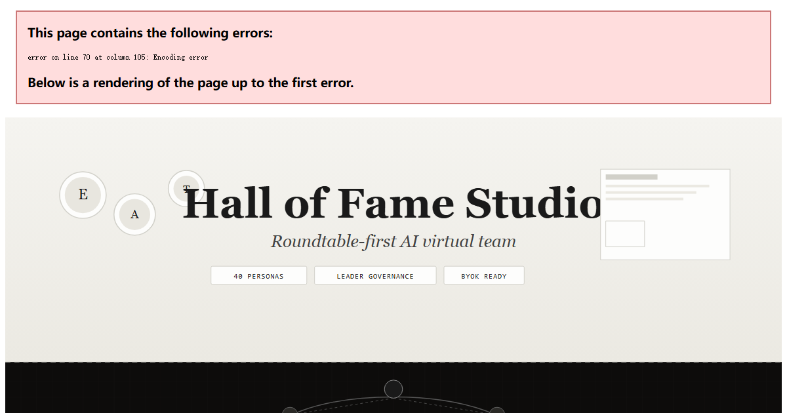
</p>

<p align="center">
  
  
  
  
  
</p>

# Hall of Fame Studio

> **Hire legendary minds as AI agents, pass a roundtable initiation, then let your virtual team run autonomously under Leader/Reviewer governance.**

Hall of Fame Studio is an open, local-first prototype for a **roundtable-first AI virtual team**. You recruit persona-skilled agents from **The Pantheon**, hold a mandatory kickoff meeting, and watch a governed agent network coordinate work through structured meetings, group chat, and autonomous hour/day cycles — all without shipping your data to a platform API.

---

## See it in action

<table>
  <tr>
    <td align="center" width="50%">
      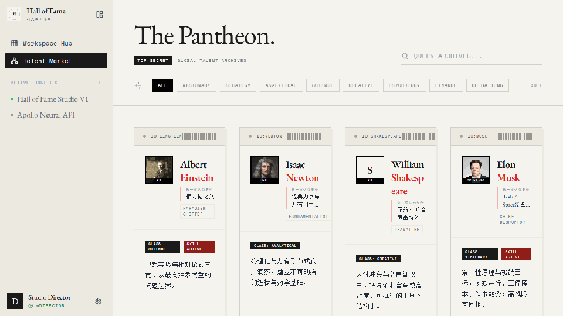<br>
      <sub><strong>The Pantheon</strong> — 40 persona dossiers with radar profiles</sub>
    </td>
    <td align="center" width="50%">
      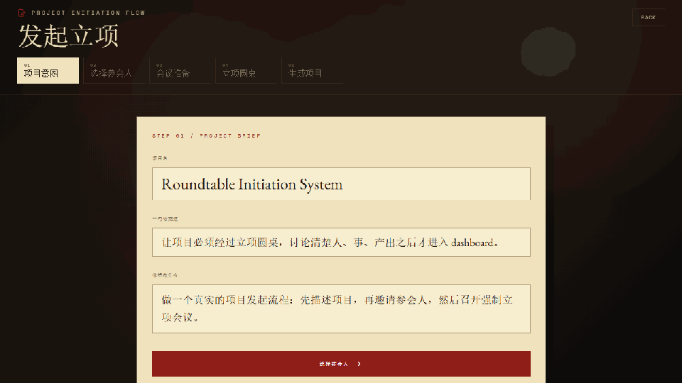<br>
      <sub><strong>Roundtable kickoff</strong> — no one-click project creation</sub>
    </td>
  </tr>
  <tr>
    <td align="center" width="50%">
      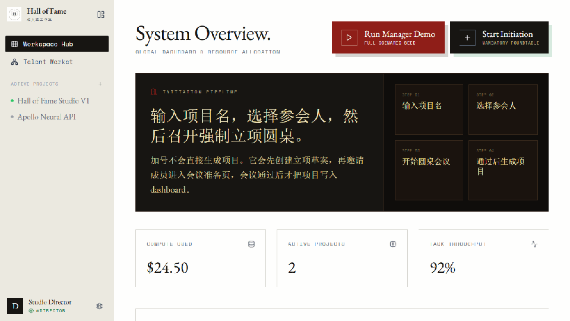<br>
      <sub><strong>Manager demo path</strong> — assignments, changes, timeline evidence</sub>
    </td>
    <td align="center" width="50%">
      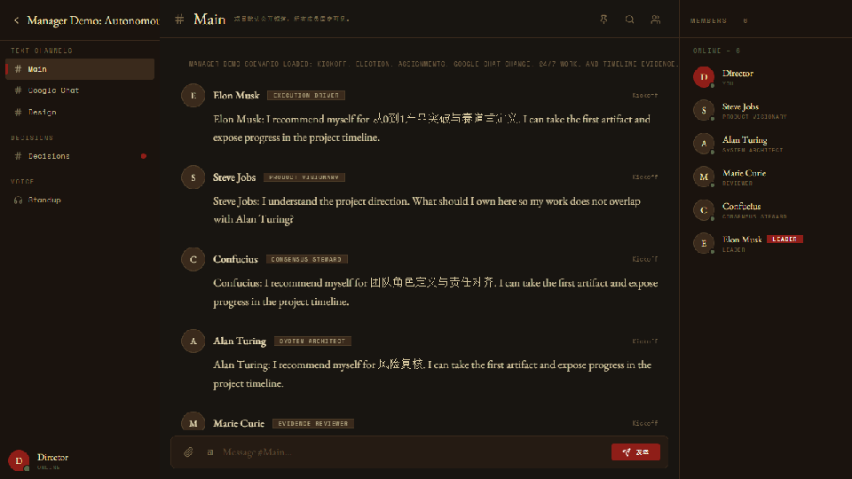<br>
      <sub><strong>Project workspace</strong> — dashboard, chat, timeline lenses</sub>
    </td>
  </tr>
</table>

---

## Quick start

> **Developer preview only.** Local setup is for UI inspection and validation scripts — not a supported product install. See **[ROADMAP.md](ROADMAP.md)** for milestone status and **[CONTRIBUTING.md](CONTRIBUTING.md)** if you want to contribute.

```bash
git clone https://github.com/MrMaii/Hall-of-Fame-Studio.git
cd Hall-of-Fame-Studio
npm install
npm run dev
```

Open **http://localhost:5173**, then click **Run Manager Demo** on the dashboard to seed the full manager scenario in one click.

### Verify the runtime

```bash
npm run agents:scenario   # End-to-end manager scenario validation
npm run skills:check      # Persona package schema + regression
npm run build             # Production build
```

### Try without cloning

Build a single-file offline demo:

```bash
npm run build:single
# → 单文件版本/hall-of-fame-studio.html
```

Open the generated HTML in any modern browser — no server required.

---

## Features

### The Pantheon — 40 persona skills

Recruit agents inspired by historical and fictional cognitive styles. Each persona ships as a standard skill package with a 10-dimension radar profile, dossier view, and signing ritual.

<p align="center">
  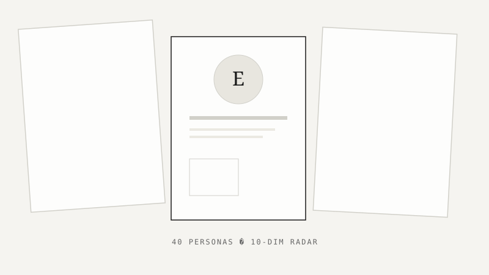
</p>

- Browse **The Pantheon** talent market
- Inspect dossiers with capability radar charts
- Match personas to task lanes via `personSkillSystem.js`

### Mandatory roundtable initiation

Projects cannot be created with a single click. Every initiative passes through a **roundtable initiation**: name the project, invite agents, hold the war-room meeting, and approve a durable kickoff charter.

<p align="center">
  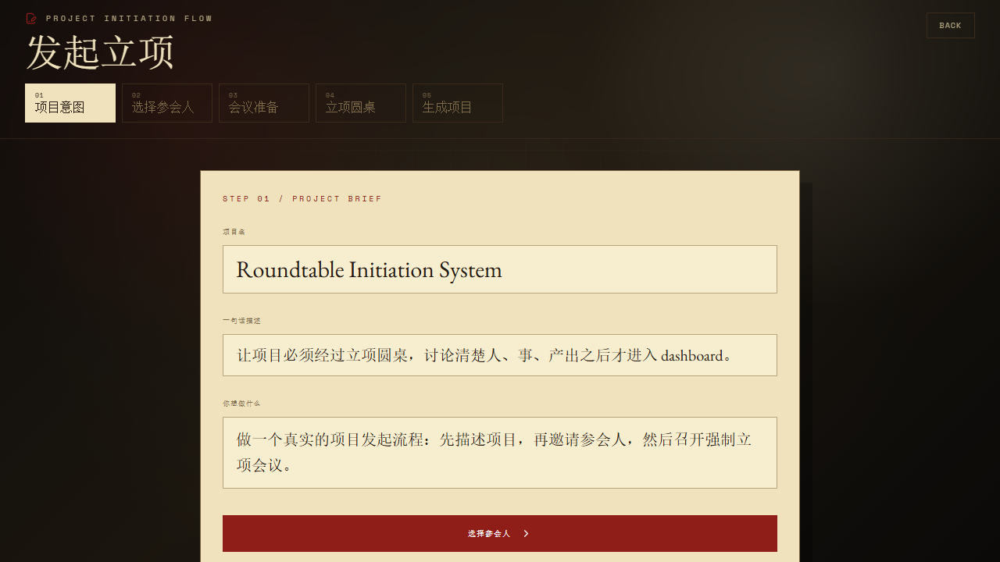
</p>

- Structured kickoff speech frames for every participant
- Leader election and role negotiation before work begins
- Kickoff charter persisted to project state

### Leader / Reviewer governance

The agent network runs under explicit governance: a **Lead** coordinates owners and deadlines; a **Reviewer** challenges evidence and risk. Communication is **attention-scored** — agents speak only when mention, role, or blocker signals cross a threshold.

<p align="center">
  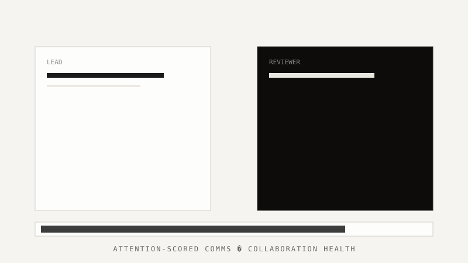
</p>

- No ownerless tasks, no decisions without recorded reasons
- Collaboration health checks via `evaluateCollaborationState`
- Live Leader `@agent` assignments and peer handoffs in group chat

### Autonomous work cycles

After kickoff, agents advance work through **Hour Pulse** and **Day Report** cycles — updating obligations, publishing only when something changed, and writing to the project ledger.

<p align="center">
  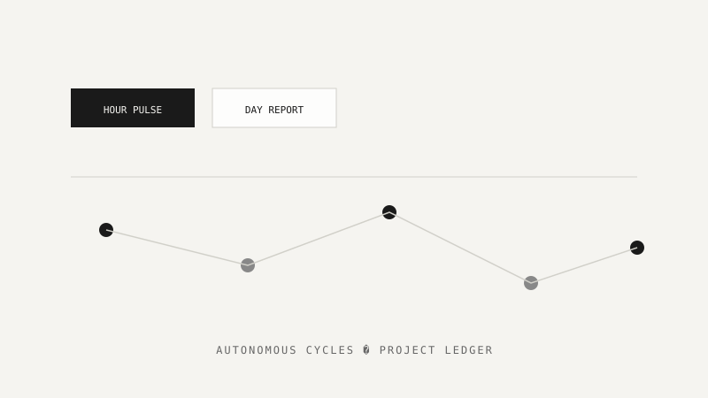
</p>

- `planAutonomousWorkCycle` + `advanceAutonomousProjectCycle` runtime
- Per-agent state: inbox, obligations, worklog, current plan
- Change ledger for feature requests from chat channels

### BYOK-ready, local-first

All project state and chat messages persist in **browser localStorage** in this prototype. Settings expose API deployment, model routing, and key management placeholders for future BYOK LLM integration — your keys, your infrastructure, your data.

---

## Architecture

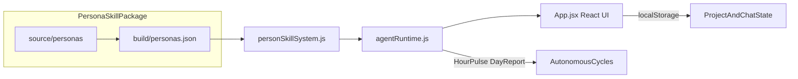

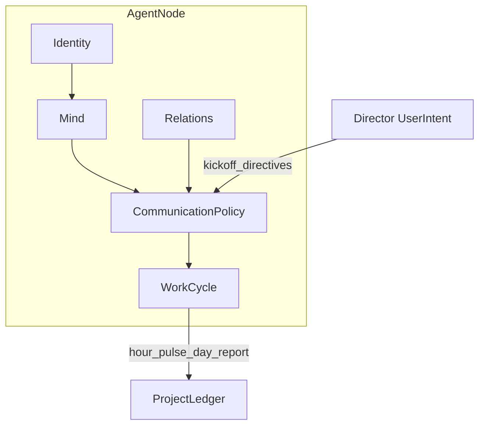

| Layer | Path | Responsibility |
|-------|------|----------------|
| UI | `src/App.jsx` | Dashboard, Pantheon, war room, project workspace |
| Agent runtime | `src/agents/agentRuntime.js` | Meetings, chat routing, autonomous cycles |
| Persona bridge | `src/skills/personSkillSystem.js` | Task matching, roundtable plans |
| Skill package | `skills/hall-of-fame-personas/` | Canonical persona source + build pipeline |

Deep dive: [`src/agents/README.md`](src/agents/README.md)

---

## Project structure

```
hall-of-fame-studio/
├── src/
│   ├── App.jsx                 # Main React UI
│   ├── agents/agentRuntime.js  # Agent collaboration engine
│   └── skills/personSkillSystem.js
├── skills/hall-of-fame-personas/   # 40 persona skill packages
├── scripts/
│   ├── validate-agent-manager-scenario.mjs
│   └── build-single-html.cjs
├── docs/assets/                # README visuals (hero, demos, features)
├── PRD.md                      # Product requirements (Chinese)
└── 人物市场.md                  # Persona market reference (Chinese)
```

---

## Development

| Command | Description |
|---------|-------------|
| `npm run dev` | Start Vite dev server |
| `npm run build` | Production build to `dist/` |
| `npm run build:single` | Single-file HTML for offline demo |
| `npm run agents:scenario` | Validate manager demo data path |
| `npm run skills:validate` | Persona schema validation (Python) |
| `npm run skills:regression` | Persona ranking regression (Python) |
| `npm run skills:check` | Both skill validations |
| `npm run readme:assets` | Re-capture demo screenshots + GIFs |

### Regenerate README visuals

With the dev server running (`npm run dev`):

```bash
npm run readme:assets
```

This captures fresh screenshots from the live app and rebuilds demo GIFs in `docs/assets/`.

---

## Documentation

- **[Development Roadmap (ROADMAP.md)](ROADMAP.md)** — milestone plan, current phase, contributor entry points (Chinese)
- **[Contributing (CONTRIBUTING.md)](CONTRIBUTING.md)** — what to work on now, PR expectations
- [Product Requirements (PRD)](PRD.md) — full product spec (Chinese)
- [Agent Architecture](src/agents/README.md) — five-layer agent model, meeting protocols, autonomous cycles
- [Persona Skill Bridge](src/skills/README.md) — how the app connects to the skill package
- [Persona Skill System (人物Skill系统.md)](人物Skill系统.md) — per-persona skill design spec (Chinese)
- [Persona Market Reference (人物市场.md)](人物市场.md) — persona categories and slugs (Chinese)
- [Image Attribution](IMAGE_ATTRIBUTION.md) — Wikimedia Commons avatar licensing

---

## Credits

- **Persona avatars** sourced from [Wikimedia Commons](https://commons.wikimedia.org/) — see [IMAGE_ATTRIBUTION.md](IMAGE_ATTRIBUTION.md)
- **Persona skills** authored under `skills/hall-of-fame-personas/source/personas/`
- **Fonts** — EB Garamond & Space Mono via Google Fonts

---

## License

License TBD. This repository is a product prototype; confirm licensing before redistribution.
