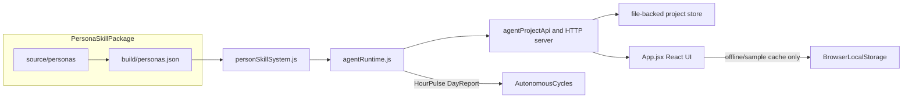
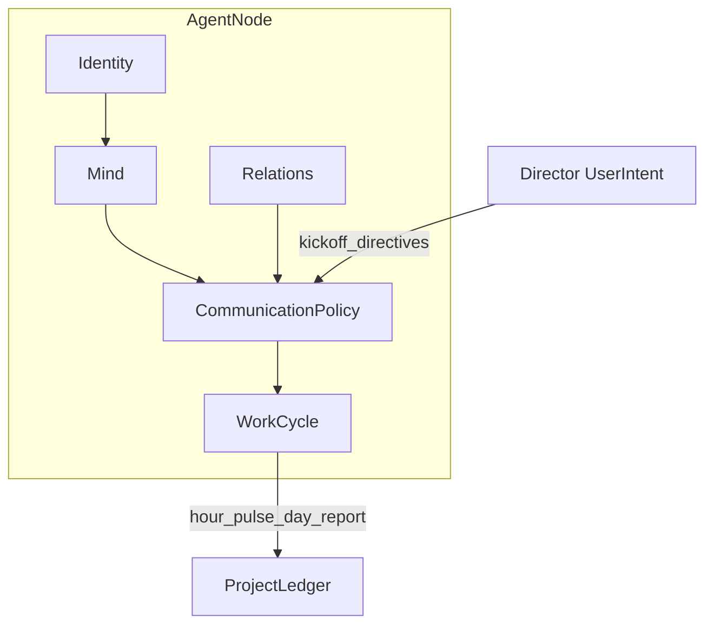

> ## ⚠️ Pre-alpha — Not usable yet / 暂不可用
>
> **This project is under active development and is not ready for real-world use.**  
> Security guarantees are **not in place** — do not deploy for production, team workflows, or sensitive data.
>
> **本项目仍处于早期研发，不可用于真实项目或生产环境。**  
> 安全机制尚未完备，**请暂时不要使用**。
>
> **Current focus:** (1) per-persona skill design · (2) agent collaboration · (3) runtime algorithm  
> **当前阶段：** 人物 Skill 设计 → Agent 协作机制 → 运行算法（详见 **[ROADMAP.md](ROADMAP.md)**）

<p align="center">
  
</p>

<p align="center">
  
  
  
  
  
</p>

# Hall of Fame Studio

> **Hire legendary minds as AI agents, pass a roundtable initiation, then let your virtual team run autonomously under Leader/Reviewer governance.**

Hall of Fame Studio is an open, local-first prototype for a **roundtable-first AI virtual team**. You recruit persona-skilled agents from **The Pantheon**, hold a mandatory kickoff meeting, and watch a governed agent network coordinate work through structured meetings, group chat, and autonomous hour/day cycles — all without shipping your data to a platform API.

---

## See it in action

<table>
  <tr>
    <td align="center" width="50%">
      <br>
      <sub><strong>The Pantheon</strong> — 40 persona dossiers with radar profiles</sub>
    </td>
    <td align="center" width="50%">
      <br>
      <sub><strong>Roundtable kickoff</strong> — no one-click project creation</sub>
    </td>
  </tr>
  <tr>
    <td align="center" width="50%">
      <br>
      <sub><strong>Manager sample fixture</strong> — assignments, changes, timeline evidence</sub>
    </td>
    <td align="center" width="50%">
      <br>
      <sub><strong>Project workspace</strong> — dashboard, chat, timeline lenses</sub>
    </td>
  </tr>
</table>

---

## Quick start

> **Developer preview only.** Local setup is for UI inspection and validation scripts — not a supported product install. See **[ROADMAP.md](ROADMAP.md)** for milestone status and **[CONTRIBUTING.md](CONTRIBUTING.md)** if you want to contribute.

```bash
git clone https://github.com/MrMaii/Hall-of-Fame-Studio.git
cd Hall-of-Fame-Studio
npm install
npm run dev
```

Open **http://localhost:5173**, then click **Load Sample Fixture** on the dashboard to inspect the Manager Demo sample data. Real project work should start from the initiation workflow, not the sample fixture.

### Verify the runtime

```bash
npm run agents:scenario   # End-to-end manager scenario validation
npm run agents:product-team:research-sample # Fast Research-as-validation-sample gate for the generic product-team delivery trace
npm run agents:product-team # Generic product-team acceptance sample with submissions, evidence, reviews, HTTP scheduler proof, audit stream, migration dry-run, operations readiness, incident drill, adapter gateway preflight, deployment preflight, project evidence archive, and launch hardening contracts
npm run adapters:gateway-server:validate # Validate the runnable private adapter gateway process plus project API dry-run/preflight routes
npm run adapters:gateway-postgres-store:validate # Validate Postgres-compatible gateway store schema/write/readback parity with a bound query shim
npm run skills:check      # Persona package schema + regression
npm run build             # Production build
```

### Try without cloning

Build a single-file offline demo:

```bash
npm run build:single
# → 单文件版本/hall-of-fame-studio.html
```

Open the generated HTML in any modern browser — no server required.

---

## Features

### The Pantheon — 40 persona skills

Recruit agents inspired by historical and fictional cognitive styles. Each persona ships as a standard skill package with a 10-dimension radar profile, dossier view, and signing ritual.

<p align="center">
  
</p>

- Browse **The Pantheon** talent market
- Inspect dossiers with capability radar charts
- Match personas to task lanes via `personSkillSystem.js`

### Mandatory roundtable initiation

Projects cannot be created with a single click. Every initiative passes through a **roundtable initiation**: name the project, invite agents, hold the war-room meeting, and approve a durable kickoff charter.

<p align="center">
  
</p>

- Structured kickoff speech frames for every participant
- Leader election and role negotiation before work begins
- Role self-nominations and Leader campaign pitches appear as proofed self-marketing nodes in Manager Flow Graph
- Kickoff charter persisted to project state
- Kickoff generation provenance labels deterministic validation, model-provider rehearsal, provider-backed model generation, or development fallback in both initiation and the approved project Dashboard while keeping production claims blocked
- Revision notes and final deliverables can link back to Reviewer change requests, superseding earlier drafts with proofed revision edges
- Evidence searches carry source quality signals and aggregate judgement into Dashboard, Flow Graph, and task proof
- Evidence quality audit packages summarize search rows, source quality, source safety, provider provenance, proof routes, and decision gates for Manager review

### Leader / Reviewer governance

The agent network runs under explicit governance: a **Lead** coordinates owners and deadlines; a **Reviewer** challenges evidence and risk. Communication is **attention-scored** — agents speak only when mention, role, or blocker signals cross a threshold.

<p align="center">
  
</p>

- No ownerless tasks, no decisions without recorded reasons
- Collaboration health checks via `evaluateCollaborationState`
- Live Leader `@agent` assignments and peer handoffs in group chat

### Autonomous work cycles

After kickoff, agents advance work through **Hour Pulse** and **Day Report** cycles — updating obligations, publishing only when something changed, and writing to the project ledger.

<p align="center">
  
</p>

- `planAutonomousWorkCycle` + `advanceAutonomousProjectCycle` runtime
- Per-agent state: inbox, obligations, worklog, current plan
- `agent-autonomous-strategy-decision/v1` records why an Agent worker chooses review response, teammate review, completed-work submission, management response, continued work, or monitoring
- `GET|POST /projects/:id/agent-autonomous-action-queue` turns those strategy decisions into a backend-readable and executable queue, so Manager Dashboard, Readiness Proof Map, and Manager Flow Graph can show the Agent's selected next action before it is run
- Bounded Autopilot sessions now read the generic Product Team Delivery Trace, convert the next missing stage into target controls, inject those controls into the delegated execution payload, and persist run/loop/session receipts for Dashboard, Flow Graph, Proof Map, and Agent Dashboard traceability
- `POST /workers/autopilot/due` can advance active bounded Autopilot sessions from the backend scheduler path, and Worker Queue Snapshot exposes those sessions as `autopilot-session` rows with idempotency, lease, direct tick, and proof refresh contracts
- The React Backend Worker Station now makes that scheduler path the main Autopilot continuation control: `Scheduler Tick` calls `/workers/autonomous/tick` with Autopilot enabled, then shows the `/workers/autopilot/due` worker receipt while keeping `Direct Tick` as a manual diagnostic fallback
- Backend Worker Station `Start` now lets the backend own the immediate project pulse and per-Agent startup sweep, then the UI reads back project/Manager/queue state; this avoids parallel browser pulse writes overwriting Agent worker ledger proof
- Agent due-worker and HTTP scheduler tick/start responses now include the post-run Agent autonomous action queue, so C-side scheduler controls can display the A-side next-action state immediately after backend work advances
- The Manager UI can sync and run that Agent queue through the backend, then refresh Agent/Manager read models from receipts instead of inferring local worklog state
- Change ledger for feature requests from chat channels

### BYOK-ready, local-first

Frontend mock replacement is now treated as a backend contract problem, not a visual cleanup task. Agent evidence-search, submission, and artifact-draft routes plus Manager command/walkthrough/action, chat/meeting/change, autonomous-cycle, due-worker, and production-control receipt routes support `includeReadModels: false`; they return a lightweight backend receipt plus explicit Manager/Agent/launch-control read-model refresh routes. The Agent Focus Workbench consumes this path for evidence, typed submissions, and draft+submit actions, while Manager, worker, and production receipt routes can now use the same receipt-first pattern; real backend-online projects should refresh Manager Dashboard, Manager Ready Package, Manager Flow Graph, Agent Dashboard, and production launch/control read models instead of generating local rows. Chat, meeting, Manager change, Leader assignment, and direct Hour/Day pulse controls now fail closed for backend-online real projects: if the backend command fails, the UI shows the failure instead of mutating browser-local state.

`npm run ui:manager-private-pilot` is the C-side private-pilot handoff and closeout gate. It first prepares the generic product-team acceptance project through `npm run agents:product-team:private-pilot:launch-handoff`, then opens the real browser UI, syncs the backend project, records Manager/security launch approvals, requests and approves the project evidence export, records the download audit, clicks the four Manager Ready Package receipt buttons for release candidate, launch run, launch health, and customer acceptance, and verifies Manager Flow Graph plus Readiness Proof Map evidence after those clicks.

`docs/LAUNCH_READINESS_GATES.md` is the operational launch gate matrix. It separates P0 local backend MVP, P1 customer private pilot, and P2 public production; lists the exact validation commands for each tier; and keeps public production blocked until managed persistence, queue/cron, BYOK/provider, security, operations, evidence export, and launch-governance controls are proven. `npm run launch:gates` verifies the matrix stays tied to runnable package scripts, while `npm run launch:infra` runs the P2 infrastructure rehearsal for the adapter gateway, reference private gateway server, Agent HTTP server env-gateway mode, and Postgres-compatible storage boundary.

Current project persistence direction: browser `localStorage` is now an offline/cache fallback, not the target source of truth for backend-online projects. The React dashboard can sync `GET /projects`, open projects through `GET /projects/:id`, refresh group-chat transcripts through `GET /projects/:id/transcripts` and channel transcript routes, refresh workflow proof through `GET /projects/:id/timeline` and `GET /projects/:id/events`, refresh core proof submodels through standalone brainstorm/artifact/review/evidence/custody routes, and run full Ready Package proof-model syncs across pilot/launch/production-control/provider/operations/persistence/queue/security routes. Browser snapshot writes are limited to explicit demo/sample or development-fallback projects; real backend projects must mutate through backend command/receipt routes. Browser-local runtime fallback for failed write commands is limited to offline mode, explicit demo/sample projects, or the development-only `__HOF_ALLOW_LOCAL_RUNTIME_FALLBACK__` / `hall_of_fame_studio.dev_local_runtime_fallback.v1` / `VITE_HOFS_ALLOW_LOCAL_RUNTIME_FALLBACK=true` switches.

For backend-online real projects, absent production launch/control/evidence/receipt read models now render as `backend-model-missing` / `backend-required` instead of frontend-synthesized production rows. Derived production fallback rows are limited to offline and explicit demo/sample use, so the Manager UI does not overstate C-side readiness when the A-side backend has not produced the contract.

Backend-online real projects now treat the local backend store as the canonical project state. Browser `localStorage` remains an offline/sample cache for UI settings, explicit demo fixtures, and development fallbacks; real projects should move through backend command routes, receipt rows, read-model refresh routes, transcript/timeline/event ledgers, and file-backed persistence. Settings still expose API deployment, model routing, evidence provider status, and BYOK/key-management placeholders -- your keys, your infrastructure, your data. The local backend exposes redacted provider/model/search status, source-safety and provider receipt proof, route policy coverage, membership/identity-session contracts, evidence/artifact/review/custody workflows, private-pilot launch and handoff workflows, operations/provider/security/persistence/queue readiness, and production-control receipt contracts. These routes make Manager Ready Package, Manager Flow Graph, Readiness Proof Map, Agent Dashboard, and launch-control surfaces consume backend evidence instead of browser-generated rows while keeping public production blocked until real managed controls exist.

`GET|POST /projects/:id/production-deployment-control-receipts` is the deployment counterpart to the existing operations/security/provider receipt routes. It exposes `production-deployment-control-receipt-workflow/v1`, records checksummed `production-deployment-control-receipt/v1` evidence, projects verified deployment receipts into the `production-infrastructure-rehearsal/v1` deployment domain, renders the Manager UI deployment receipt card, and exports `production_deployment_control_receipts` persistence/migration rows.

`GET /projects/:id/production-launch-audit` exposes the unified release audit package. It combines MVP readiness, private-pilot launch readiness, deployment preflight, proof routes, security/provider/operations gates, project evidence handoff status, production evidence integrity, production blockers, and a checksum so the Manager Ready Package can approve a completed local acceptance project for private pilot while still returning production `no-go` until real managed controls exist. When the core private-pilot gates pass but the evidence package has not been download-audited, `nextShortestPath.scope` points to `private-pilot-handoff`; after `project-evidence-export-package/v1` is ready it returns to `production-hardening`.

`GET /projects/:id/production-launch-gap-register` exposes `production-launch-gap-register/v1`, a Manager-readable action register for the remaining public-production launch work. It normalizes blockers from production launch audit, production evidence integrity audit, deployment preflight, production operations readiness, provider readiness, evidence custody, artifact quality, and submission review governance into deduplicated gap rows with domain, owner, severity, action, route, proof ids, timeline/event ids, upstream checksums, and next action. Manager Ready Package embeds it, Manager Flow Graph adds a gap-register decision node, Readiness Proof Map exposes `productionLaunchGapRoutes`, Security Boundary lists the route policy, and Manager UI renders the gap register. It is a planning and accountability surface; it keeps `readyForProduction: false` until real managed controls close.

`GET /projects/:id/production-launch-control-center` exposes `production-launch-control-center/v1`, a Manager-facing public-production release control view. It aggregates the launch audit, gap register, private-pilot go-live state, production operations receipts, production deployment receipts, production security receipts, production provider receipts, production evidence integrity audit, launch approvals, deployment preflight, provider readiness, security boundary, custody, and artifact quality into control rows, blocked rows, owner rows, stage rows, next action, proof ids, timeline/event ids, upstream checksums, and checksum. Manager Ready Package embeds it, Manager Flow Graph adds a control-center decision node, Readiness Proof Map exposes `productionLaunchControlCenterRoutes`, Security Boundary lists the route policy, and Manager UI renders the control center. It is read-only and keeps `productionDecision: no-go` until all real production controls, managed-production evidence, and approvals close.

`GET /projects/:id/production-launch-evidence-dossier` exposes `production-launch-evidence-dossier/v1`, a Manager-readable launch evidence package that turns the production launch audit, gap register, control center, evidence integrity audit, private-pilot go-live state, deployment/security/provider/operations readiness, and production receipt workflows into one manifest. It lists every evidence route, four production control domains, remaining gaps, proof/timeline/event ids, checksums, and the current `productionDecision`. Manager Ready Package embeds it, Manager Flow Graph adds a dossier node fed by the control center, gap register, and evidence integrity audit, Readiness Proof Map exposes `productionLaunchEvidenceDossierRoutes`, Security Boundary lists the route policy, and Manager UI renders the dossier. It is an audit package for launch review; it keeps `readyForProduction: false` until real managed-production evidence and all release gates close.

`GET /projects/:id/production-evidence-integrity-audit` exposes `production-evidence-integrity-audit/v1`, a read-only audit over production operations, deployment, security, and provider control receipts. It classifies every required control as `missing`, `local-rehearsal`, `external-unattested`, or `managed-production`, surfaces domain rows, proof ids, timeline/event ids, backend routes, summary counts, and checksum, feeds the production launch audit and production launch gap register, appears in Manager Flow Graph / Readiness Proof Map, and renders in the Manager UI. The product-team Harness now verifies both sides of the guardrail: local `.test` receipt evidence stays blocked, while explicit `evidenceEnvironment: "managed-production"` receipts can make only this evidence audit production-evidence-ready and close the matching launch-audit/gap-register row. This prevents local rehearsal receipts from being mistaken for a public-production certificate.

`GET /projects/:id/project-evidence-archive` exposes the full `project-evidence-archive/v1`, a manager-verifiable redacted archive contract with manifest checksums for project state, transcripts, submissions, final deliverables, evidence searches, reviews, revision lineage, Flow Graph nodes, Proof Map routes, timeline, event ledger, readiness models, persistence summary, and worker recovery evidence. Manager Ready Package embeds the same archive status, route, gates, manifest, and checksums in manifest-only mode so the dashboard stays responsive while the standalone route remains the complete evidence bundle. It is suitable for private-pilot/customer handoff validation, not a production export system until encrypted object storage, signed/expiring download URL issuance, watermarking, retention enforcement, download audit storage, and data residency controls are added.

Readiness Proof Map now also exposes `transcriptProofCoverageRoutes` / `transcriptProofCoverageSummary`, and the Manager UI renders the same backend transcript coverage in Backend Manager Snapshot plus Manager Proof Map, so the Manager can monitor whether submission, evidence, source-review, and submission-review chat proof is backed by backend transcripts before opening the full archive.

Group Chat Transcript Index also labels its data source and fails closed for backend-online real projects: if the backend transcript read model is absent, the dashboard shows `backend-required` and suppresses browser-local recovered chat counts until transcript sync succeeds.

`GET /projects/:id/brainstorm-layer` exposes `brainstorm-layer/v1`, a read-only Manager view over generic `brainstorm-board` submissions. It parses visible alternatives, links discovery/evidence/downstream decision and delivery artifacts, preserves chat/timeline/event proof, adds a Flow Graph `brainstorm-layer` aggregate node, exposes Readiness Proof Map `brainstormLayerRoutes`, renders in Manager Ready Package UI, and keeps production blocked. Research Project uses this as the validation sample, but the contract is a generic product-team brainstorm layer.

Agent Dashboard now embeds `agent-brainstorm-contribution/v1` for the submitting Agent. It shows that Agent's brainstorm boards, visible alternative directions, proof ids, timeline/event ids, project evidence/downstream follow-through counts, and the route back to the Manager `brainstorm-layer` view so personal initiative is visible without duplicating Manager-only data.

`GET /projects/:id/evidence-quality-audit` exposes `evidence-quality-audit/v1`. It aggregates Agent evidence-search rows, per-source quality/safety signals, provider provenance, Readiness Proof Map routes, decision gates, required production controls, and a checksum. Manager Ready Package and the project evidence archive embed the same audit summary so the Manager can see whether current evidence is decision-ready while production remains blocked until real search gateways, calibrated source-quality policy, managed provider/source audit storage, and human review policy exist.

`GET /projects/:id/artifact-quality-audit` exposes `artifact-quality-audit/v1`. It audits all Agent submissions as generic product-team artifacts: required artifact type coverage, title/summary/body readiness, chat/timeline/event/artifact proof links, review/revision/final-deliverable closure, generated draft quality status, redaction status, production controls, and checksum. Manager Ready Package, Readiness Proof Map, Project Evidence Archive, Pilot Launch Readiness, Production Launch Audit, route policy, and Manager UI consume the same model. The evidence archive now also gates complete artifact storage/workspace proof coverage for every submission, so customer handoff cannot pass with frontend-only artifact nodes. It can prove private-pilot artifact readiness for the acceptance project, but production remains blocked until calibrated artifact rubrics, eval datasets, human release policy, managed output audit storage, and retention controls exist.

`GET /projects/:id/project-evidence-archive` also reports transcript proof coverage. Agent submission, evidence search, evidence source review, and submission review message ids must be present in backend transcripts or archived proof before the archive can pass, so Manager chat proof exits cannot rely on browser-only conversation history for real projects.

`GET /projects/:id/submission-review-workflow` exposes `submission-review-workflow/v1`. It aggregates generic submission reviews, requested changes, revision responses, final-deliverable acceptance, proof routes, timeline/event ids, and local closure gates into one Manager-readable review loop. Manager Ready Package, Manager Flow Graph, Readiness Proof Map, Security Boundary, Manager UI, and the product-team Harness consume the same model so a product team can prove that draft review, requested changes, revision, and final acceptance closed without turning the system into a research-only workflow. It can prove private-pilot review closure, but production review governance remains blocked until calibrated review policy, durable Reviewer identity lifecycle, immutable output audit storage, and customer-specific acceptance thresholds exist.

`GET|POST /projects/:id/evidence-source-review-workflow` exposes `evidence-source-review-workflow/v1` and accepts `evidence-source-review/v1` Reviewer decisions. `GET` derives reviewer-visible source review items from the evidence quality audit, preserving source quality/source-safety signals, local source snapshot ids, provider receipt ids, reviewer handoff, review queue, submitted decisions, proof routes, gates, production controls, and checksum. `POST` records a Reviewer decision for an evidence source, publishes group-chat proof, writes timeline/event ledger proof, updates the evidence search/task/Agent dashboards, creates Manager Flow Graph source-review nodes, archives decision records, and normalizes rows into `evidence_source_reviews`. Manager Ready Package, project evidence archive, pilot readiness, production launch audit, access policy, and Manager UI all include the workflow so a product-team decision can show which evidence sources were approved, queued, snapshotted, receipted, or blocked. Production remains blocked until human source-review policy, calibrated source-quality policy, managed immutable source/provider receipt storage, and reviewer audit storage exist.

`GET /projects/:id/evidence-custody-readiness` exposes `evidence-custody-readiness/v1`. It turns source snapshots, provider receipts, and submitted source-review decisions into a local custody table with checksums, proof ids, timeline/event links, Manager Flow Graph custody nodes, Readiness Proof Map custody routes, archive manifest coverage, and a managed-storage production blocker. It can prove private-pilot/local custody readiness for the Research Project acceptance sample without making the system research-only; production remains blocked until immutable object storage, signed custody access, retention/deletion jobs, and centralized custody audit exist.

`POST /projects/:id/agents/:agentId/artifact-drafts` lets an Agent generate a generic product-team artifact draft from project context, linked task, evidence searches, prior submissions, and review feedback. The route returns `agent-artifact-draft/v1`; with `submit: true`, the generated draft immediately enters the same Agent submission contract used by Flow Graph, Task Evidence, Readiness Proof Map, timeline, event ledger, artifact files, archive, and persistence snapshots. Manager Dashboard and Agent Dashboard preserve generated-draft provenance, including draft id, source, checksum, local/model status, quality status, human-review requirement, and route. The acceptance Harness now covers both the local fallback generator and a deterministic model-backed `model:artifact-draft` provider call with provider usage proof, `artifact-draft-quality/v1` gates, and Provider Readiness model-draft quality/human-review summaries; production BYOK rollout still requires real provider credentials, calibrated quality evaluation, incident controls, and cost governance.

`GET /projects/:id/provider-controlled-run` exposes `provider-controlled-run/v1`, a policy dry-run for the model/search operations that would be allowed in a private-pilot BYOK run. It evaluates provider health checks, kickoff/intent model support, model artifact drafting, and evidence search against provider allowlists, Agent tool grants, daily budget, hourly request limits, retry/circuit state, usage-ledger proof, human-review boundaries, evidence governance, and redaction status without issuing a provider call. Manager Ready Package, Readiness Proof Map, Security Boundary route policy, and Manager UI consume the same contract. It can prove local/private-pilot run readiness, but production remains blocked until real provider eval runs, managed provider audit storage, centralized cost alerting, production incident runbooks, and calibrated human release policy exist.

`GET|POST /projects/:id/provider-eval-runs` exposes `provider-eval-run-workflow/v1` and records `provider-eval-run/v1` shadow replay receipts. `GET` shows whether a controlled provider plan has been replayed against existing provider usage-ledger proof. `POST` records a no-call shadow replay that binds `model:artifact-draft` and `search:evidence` proof ids, timeline logs, event-ledger ids, policy/circuit decisions, human-review/evidence/redaction boundaries, and production blockers into Manager Ready Package, Manager Flow Graph, Readiness Proof Map, Security Boundary route policy, Manager UI, and `provider_eval_runs` persistence rows. This proves private-pilot provider-eval readiness locally; production still requires real provider eval datasets, managed eval storage, centralized cost alerts, incident runbooks, and calibrated release policy.

`GET|POST /projects/:id/production-provider-control-receipts` exposes `production-provider-control-receipt-workflow/v1` and records checksummed `production-provider-control-receipt/v1` evidence. Runtime-platform or security admins can attach provider rollout receipts for allowlists, budgets/rate limits, Agent tool grants, retry/circuit breakers, provider audit/cost ledger, encrypted secret-vault proof, source safety review, source/provider snapshots, model-output quality review, real-provider eval, managed audit/eval storage, centralized cost alerting, release policy, and incident runbooks. These receipts update Manager Ready Package, Production Launch Gap Register, Production Launch Control Center, Manager Flow Graph, Readiness Proof Map, Security Boundary, Manager UI, timeline/event proof, and `production_provider_control_receipts` persistence rows. Passing this read model clears the provider rollout slice only; public production can still remain `no-go` for deployment, approvals, operations, security, or other launch controls.

`GET|POST /projects/:id/project-evidence-exports` exposes the private-pilot evidence export governance workflow. It returns `project-evidence-export-workflow/v1`, persists checksummed `project-evidence-export/v1` request/approval/download-audit records, pins each request to the archive checksum generated for that request, requires Manager plus security-admin approval for private-pilot handoff, and mirrors proof into Manager Ready Package, Manager Flow Graph, Readiness Proof Map, timeline, event ledger, security route policy, and the `project_evidence_exports` persistence/migration rows. After approval, `POST /projects/:id/project-evidence-exports` with `action: "download-audit"` returns a local `project-evidence-export-package/v1` descriptor with archive manifest checksums, watermark metadata, retention/data-residency metadata, package gates, and a download-audit receipt; `GET /projects/:id/project-evidence-exports/:exportRequestId/package` reads that descriptor back. Production export remains blocked until real encrypted storage, signed expiring download URL issuance, watermark enforcement, retention deletion, centralized download audit, and data-residency controls exist.

`GET /projects/:id/private-pilot-go-live-readiness` exposes `private-pilot-go-live-readiness/v1`, a Manager-readable command view over the private-pilot launch path. It aggregates generic delivery proof, release approvals, evidence handoff package, provider eval, deployment/operations/security preflight, release candidate, launch run, post-launch health, customer acceptance, and production-operations hardening receipts into stage rows, current phase, next action, proof ids, timeline/event ids, and checksum. Manager Ready Package embeds it, Manager Flow Graph adds a go-live command node, Readiness Proof Map exposes `privatePilotGoLiveRoutes`, Security Boundary lists the route policy, and Manager UI renders the stage panel. It can prove private-pilot go-live and acceptance state locally; public production remains blocked until managed infrastructure and operations controls are verified by the broader production launch audit.

`GET|POST /projects/:id/private-pilot-release-candidates` exposes the private-pilot release candidate workflow. It returns `private-pilot-release-candidate-workflow/v1`; once launch approvals, production launch audit private-pilot gates, evidence handoff package audit, provider eval shadow replay, deployment preflight, operations readiness, and security route coverage are ready, `POST` records a checksummed `private-pilot-release-candidate/v1` freeze receipt. The receipt binds the current Manager Ready Package, MVP/pilot/deployment readiness, production launch audit, project evidence archive/export package, provider eval run, operations, persistence adapter, and worker queue adapter checksums into timeline/event proof, Manager Flow Graph, Readiness Proof Map, Security Boundary route policy, Manager UI, and `private_pilot_release_candidates` persistence rows. It marks a private-pilot release candidate only; production stays blocked until real managed identity, database, queue, KMS, provider eval, centralized audit, deployment, and operations controls are complete.

`GET|POST /projects/:id/private-pilot-launch-runs` exposes the controlled private-pilot launch run workflow. It returns `private-pilot-launch-run-workflow/v1`; after a release candidate is frozen and launch audit, evidence package, provider eval, deployment preflight, operations runbook, incident drill, and security boundary remain ready, `POST` records a checksummed `private-pilot-launch-run/v1` receipt. The receipt binds the release candidate checksum plus launch audit, evidence, provider eval, deployment, operations, persistence adapter, and queue adapter checksums into timeline/event proof, Manager Flow Graph, Readiness Proof Map, Security Boundary route policy, Manager UI, and `private_pilot_launch_runs` persistence rows. It is the local/private-pilot activation receipt, not a public production go-live certificate.

`GET|POST /projects/:id/private-pilot-launch-health-checks` exposes the post-launch private-pilot health workflow. It returns `private-pilot-launch-health-check-workflow/v1`; after the launch run receipt exists and operations, worker queue adapter, persistence adapter, security boundary, provider eval, evidence archive, Flow Graph, and Proof Map remain healthy, `POST` records a checksummed `private-pilot-launch-health-check/v1` receipt. The receipt binds the launch run checksum plus operations/security/provider/evidence/persistence/queue health checks into timeline/event proof, Manager Flow Graph monitoring nodes, Readiness Proof Map, Security Boundary route policy, Manager UI, and `private_pilot_launch_health_checks` persistence rows. It proves private-pilot monitoring readiness only; public production still needs centralized observability, alert routing, on-call ownership, managed incident systems, and real restore drills.

`GET|POST /projects/:id/private-pilot-acceptance-reports` exposes the customer-visible private-pilot acceptance workflow. It returns `private-pilot-acceptance-report-workflow/v1`; after the release candidate, launch run, post-launch health, evidence handoff package, generic product-team delivery proof, operations/security/provider proof, Flow Graph, and Proof Map are all ready, `POST` records a checksummed `private-pilot-acceptance-report/v1`. The report freezes release/launch/health/evidence/Flow Graph/Proof Map checksums into timeline/event proof, Manager Flow Graph decision nodes, Readiness Proof Map, Security Boundary route policy, Manager UI, and `private_pilot_acceptance_reports` persistence rows. It is the customer private-pilot acceptance closeout, not a public production certificate.

The Manager Ready Package UI now exposes C-side receipt commands for release candidate, launch run, launch health, and acceptance report. Each command is disabled until the backend workflow says its gates are ready, then posts to the corresponding backend route, stores the returned receipt, and refreshes Manager Dashboard, Manager Ready Package, Manager Flow Graph, timeline/event proof, and launch submodels instead of mutating browser-local state.

`GET /projects/:id/production-operations-readiness` exposes `production-operations-readiness/v1`. It aggregates private-pilot acceptance, post-launch health, local operations incident-drill proof, security audit-stream proof, provider eval replay, persistence adapter dry-run, worker queue adapter dry-run, and production launch audit into one operations hardening checklist. It can mark local/private-pilot operations proof ready after the acceptance report, but keeps public production blocked until centralized logs, metrics, traces, alert routing, on-call ownership, managed incident records, real restore-drill receipts, centralized audit retention, and managed database/queue cutover approval exist.

`GET|POST /projects/:id/production-operations-control-receipts` exposes `production-operations-control-receipt-workflow/v1` and records checksummed `production-operations-control-receipt/v1` evidence. Security admins or operations owners can attach control receipts for centralized logs, metrics, traces, alert routing, on-call ownership, managed incident records, real restore drills, centralized audit retention, and managed database/queue cutover approval. These receipts update Production Operations Readiness, Manager Flow Graph, Readiness Proof Map, Security Boundary, Manager UI, timeline/event proof, and `production_operations_control_receipts` persistence rows. Passing this read model clears the operations hardening slice only; the wider Production Launch Audit can still remain `no-go` for identity, provider, KMS, deployment, or other production blockers.

`GET|POST /projects/:id/production-security-control-receipts` exposes `production-security-control-receipt-workflow/v1` and records checksummed `production-security-control-receipt/v1` evidence. Security admins can attach managed identity, service identity, managed KMS/Secret Manager, database-backed RBAC, centralized security audit, and session replay hardening receipts with evidence id/route/checksum and redacted detail. These receipts update Security Boundary production status, Manager Ready Package, Production Launch Gap/Register inputs, Production Launch Control Center, Manager Flow Graph, Readiness Proof Map, Manager UI, timeline/event proof, and `production_security_control_receipts` persistence rows. Passing this read model clears the security hardening slice only; public production can still remain `no-go` for provider, deployment, approvals, or other launch controls.

`GET|POST /projects/:id/launch-approvals` exposes the release approval workflow. It persists checksummed Manager/security-admin private-pilot approvals as `launch-approval/v1`, requires operations-owner before production approval, and mirrors approval proof into the event ledger, timeline, Flow Graph, Proof Map, production launch audit, and `launch_approvals` persistence/migration rows.

Worker queue snapshots also expose execution receipts, retry state, and a derived dead-letter queue so the local MVP can prove recovery semantics before a production queue adapter is introduced. The backend now also exposes queue adapter plan/dry-run routes that run a configurable queue adapter facade. The default `WORKER_QUEUE_ADAPTER_DRIVER=local-shadow` executes enqueue, lease, dispatch, receipt ack, retry import, dead-letter recovery, queue inspection, and `worker-queue-adapter-snapshot-parity/v1` snapshot parity locally while keeping production queue cutover blocked. When `WORKER_QUEUE_ADAPTER_DRIVER=http-json` and `WORKER_QUEUE_HTTP_ENDPOINT` or `ADAPTER_GATEWAY_HTTP_ENDPOINT` is configured, `GET /projects/:id/worker-queue-adapter-dry-run` calls the private gateway and returns a gateway execution receipt while still keeping `productionCutoverReady: false`. Managed persistence adapter plan/dry-run routes do the same for the database cutover: they require table coverage for membership, replay, audit, provider, worker, and read-model records, then run a configurable adapter facade. The default `MANAGED_PERSISTENCE_ADAPTER_DRIVER=local-shadow` executes connect, schema creation, import, shadow-read parity, transaction rollback, backup/restore, RLS coverage, and audit-stream continuity locally while keeping production cutover blocked. When `MANAGED_PERSISTENCE_ADAPTER_DRIVER=http-json` and `MANAGED_PERSISTENCE_HTTP_ENDPOINT` or `ADAPTER_GATEWAY_HTTP_ENDPOINT` is configured, `GET /projects/:id/persistence-adapter-dry-run` sends the current project snapshot and migration plan to the gateway and returns the external receipt. `postgres` / `managed-queue` still require future real drivers.

`npm run adapters:gateway` starts local mock `http-json` adapter gateways, verifies the shared health, persistence dry-run, and worker-queue dry-run receipt contract, then creates a backend project and proves the API dry-run routes can execute through that gateway. It is a contract test for future external adapters, not evidence that production persistence or queue infrastructure has been deployed.

`npm run adapters:gateway-server` starts a local private adapter gateway reference process. It exposes `GET /health`, `GET /state`, `POST /persistence/dry-run`, and `POST /worker-queue/dry-run`, stores imported shadow table records, queue rows, lease/dead-letter state, and receipt summaries through the `ADAPTER_GATEWAY_STORAGE_DRIVER` adapter, and can require `ADAPTER_GATEWAY_AUTH_TOKEN`. The default storage driver is `json-file` with `ADAPTER_GATEWAY_STORE`; `memory` is available for ephemeral validation; `postgres` / `postgres-compatible` exposes a Postgres schema/upsert/snapshot write plan using `ADAPTER_GATEWAY_POSTGRES_URL` and `ADAPTER_GATEWAY_POSTGRES_SCHEMA`. `GET /projects/:id/adapter-gateway-preflight` now proves the product backend can read the gateway's live health, advertised capabilities, and state summary before dry-run cutover, while still keeping `productionCutoverReady: false`. `npm run adapters:gateway-server:validate` proves the runnable process satisfies the shared gateway contract and can be used by project API dry-run and preflight routes. `npm run adapters:gateway-postgres-store:validate` binds the Postgres-compatible driver to a fake query function and verifies schema-plan, table-record, queue-row, lease, dry-run receipt, state snapshot, and readback parity operations. This is the deployable process shape for private pilots, while real production still needs a managed Postgres client, real database readback, durable queue leases, KMS, audit, backup/restore rehearsal, and monitoring.

---

## Architecture





| Layer | Path | Responsibility |
|-------|------|----------------|
| UI | `src/App.jsx` | Dashboard, Pantheon, war room, project workspace |
| Backend service/API | `src/agents/agentProjectService.js`, `src/agents/agentProjectApi.js`, `src/agents/agentProjectHttpServer.js` | Project commands, receipts, read models, HTTP routes, scheduler/worker boundaries |
| Agent runtime | `src/agents/agentRuntime.js` | Meetings, chat routing, autonomous cycles |
| Persona bridge | `src/skills/personSkillSystem.js` | Task matching, roundtable plans |
| Skill package | `skills/hall-of-fame-personas/` | Canonical persona source + build pipeline |

Deep dive: [`src/agents/README.md`](src/agents/README.md)

Frontend backend-replacement tracker: [`docs/FRONTEND_MOCK_REPLACEMENT_REGISTER.md`](docs/FRONTEND_MOCK_REPLACEMENT_REGISTER.md)

---

## Project structure

```
hall-of-fame-studio/
├── src/
│   ├── App.jsx                 # Main React UI
│   ├── agents/agentRuntime.js  # Agent collaboration engine
│   └── skills/personSkillSystem.js
├── skills/hall-of-fame-personas/   # 40 persona skill packages
├── scripts/
│   ├── validate-agent-manager-scenario.mjs
│   └── build-single-html.cjs
├── docs/assets/                # README visuals (hero, demos, features)
├── PRD.md                      # Product requirements (Chinese)
└── 人物市场.md                  # Persona market reference (Chinese)
```

---

## Development

| Command | Description |
|---------|-------------|
| `npm run dev` | Start Vite dev server |
| `npm run build` | Production build to `dist/` |
| `npm run build:single` | Single-file HTML for offline demo |
| `npm run agents:scenario` | Validate manager demo data path |
| `npm run agents:product-team:core` | Fast backend product-team gate through kickoff, self-marketing, evidence, brainstorm, submissions, draft/review/revision/final-deliverable proof, Flow Graph, Proof Map, Agent Dashboard, transcript, timeline, event proof, and local HTTP runtime startup |
| `npm run agents:product-team:research-sample` | Fast Research-as-validation-sample gate. It reuses the generic product-team backend/HTTP delivery trace and asserts the proven stages remain kickoff, self-marketing, brainstorm, evidence, draft, review/revision, final deliverable, and proof surfaces rather than paper/thesis/manuscript-specific protocol fields |
| `npm run agents:product-team:private-pilot:release` | Staged private-pilot gate through the release-candidate freeze receipt |
| `npm run agents:product-team:private-pilot:launch` | Staged private-pilot gate through the controlled launch-run receipt |
| `npm run agents:product-team:private-pilot:health` | Staged private-pilot gate through the post-launch health receipt |
| `npm run agents:product-team:private-pilot:acceptance` | Staged private-pilot gate through the customer acceptance report receipt |
| `npm run agents:product-team:production-ops-controls` | Focused P2 bridge gate: records production operations control receipts, projects managed persistence/queue cutover evidence into infrastructure rehearsal, and keeps broader public production blocked |
| `npm run agents:product-team:production-deployment-controls` | Focused P2 bridge gate: records production deployment control receipts, projects deployment hardening evidence into infrastructure rehearsal, and keeps broader public production blocked |
| `npm run agents:product-team:production-security-controls` | Focused P2 bridge gate: records production security control receipts, updates Security Boundary, Proof Map, and Flow Graph, and keeps broader public production blocked |
| `npm run agents:product-team:production-provider-controls` | Focused P2 bridge gate: records production provider rollout receipts, updates provider proof/control surfaces, and keeps managed-production evidence integrity blocking public production |
| `npm run agents:product-team:production-evidence-integrity` | Focused P2 bridge gate: proves local/test receipts stay rehearsal-only, then explicit managed-production receipts upgrade evidence integrity without bypassing final launch governance |
| `npm run agents:product-team:production-launch-governance` | Focused P2 launch governance gate: records signed Manager, security-admin, and operations-owner production approvals, verifies approval workflow proof, and keeps broader public production blocked |
| `npm run agents:product-team:private-pilot` | Private-pilot acceptance alias: runs the generic product-team chain through launch approvals, project evidence archive/export, release candidate, launch run, health check, and customer acceptance report, then stops before public-production hardening controls |
| `npm run agents:product-team` | Full product-team release-hardening gate with progress output. Includes the private-pilot chain plus production operations/deployment/security/provider control receipts and managed-production evidence integrity rehearsal while keeping public production blocked until real managed controls exist |
| `npm run ui:manager-backend:core` | Fast browser gate for the C/A backend control loop: sample backend adoption, Autonomous Run Control run receipts, Agent autonomous action receipts, and Autopilot scheduler tick receipts |
| `npm run adapters:gateway` | Validate the shared `http-json` adapter gateway contract with a local mock gateway for persistence and worker queue receipts |
| `npm run adapters:gateway-server` | Start the local private adapter gateway reference process for persistence and queue dry-run receipts |
| `npm run adapters:gateway-server:validate` | Validate the runnable private adapter gateway process, bearer auth, shadow table/queue persistence, leases, project API dry-run integration, and live adapter gateway preflight |
| `npm run adapters:gateway-postgres-store:validate` | Validate the Postgres-compatible gateway store schema plan, query-bound write operations, and readback parity without claiming real database cutover |
| `npm run skills:validate` | Persona schema validation (Python) |
| `npm run skills:compile` | Rebuild generated persona registry |
| `npm run skills:regression` | Persona ranking regression (Python) |
| `npm run skills:package` | Package per-persona distributable Skill artifacts |
| `npm run skills:audit` | Scan persona outputs for external-tool fingerprints |
| `npm run skills:dist` | Full persona pipeline: validate, registry, mindframe, package, audit, regression |
| `npm run skills:check` | Both skill validations |
| `npm run skills:blend` | Validate persona + professional skill blending |
| `npm run readme:assets` | Re-capture demo screenshots + GIFs |

The product-team acceptance gate also verifies `production-operations-readiness/v1` after the private-pilot acceptance report: local/private-pilot operations proof must pass, production controls must remain blocked, and the model must appear in Manager Ready Package, Flow Graph, Proof Map, Security Boundary, and Manager UI. It then records `production-operations-control-receipt/v1` evidence for all operations controls and verifies the route updates readiness, Proof Map, Flow Graph, persistence snapshot, migration dry-run, file store, and Manager UI while the broader public production launch audit can still remain blocked.

The same gate records `production-security-control-receipt/v1` evidence for managed identity, service identity, managed KMS, database RBAC, centralized security audit, and session replay hardening. The Harness requires Security Boundary to become production-security ready, requires Proof Map and Flow Graph receipt nodes/routes, imports `production_security_control_receipts` through persistence snapshot and migration dry-run, persists the file-store row, renders the Manager UI panel, and still keeps the overall Production Launch Control Center `readyForProduction: false` until the remaining public-production gates close.

The same gate records `production-provider-control-receipt/v1` evidence for provider allowlists, budgets/rate limits, Agent tool grants, retry/circuit breakers, provider audit/cost ledger, encrypted secret-vault proof, source safety and snapshot receipts, model-output quality review, real-provider eval, managed audit/eval storage, centralized cost alerting, calibrated release policy, and incident runbooks. The Harness requires Provider rollout controls to become production-provider ready, requires Proof Map and Flow Graph receipt nodes/routes, imports `production_provider_control_receipts` through persistence snapshot and migration dry-run, persists the file-store row, renders the Manager UI panel, and still keeps the overall Production Launch Control Center `readyForProduction: false` until the remaining public-production gates close.

The same gate verifies `production-launch-gap-register/v1`: Manager Ready Package, the standalone API/HTTP route, Flow Graph, Proof Map, Security Boundary, enforced access, and Manager UI must all expose owner/domain/action rows plus a routed next action while keeping public production blocked until real managed controls close.

It also verifies `production-launch-control-center/v1`: Manager Ready Package, standalone API/HTTP route, Flow Graph, Proof Map, Security Boundary, enforced access, and Manager UI must all expose gate rows, blocked rows, owner routing, routed next action, private-pilot acceptance state, operations/deployment/security/provider control state, managed-production evidence integrity state, and `readyForProduction: false`.

### Regenerate README visuals

With the dev server running (`npm run dev`):

```bash
npm run readme:assets
```

This captures fresh screenshots from the live app and rebuilds demo GIFs in `docs/assets/`.

---

## Documentation

- **[Development Roadmap (ROADMAP.md)](ROADMAP.md)** — milestone plan, current phase, contributor entry points (Chinese)
- **[Contributing (CONTRIBUTING.md)](CONTRIBUTING.md)** — what to work on now, PR expectations
- [Product Requirements (PRD)](PRD.md) — full product spec (Chinese)
- [Technical Overview](TECHNICAL.md) — Agent agency, flow-graph submissions, queues, backend Harness
- [Agent Architecture](src/agents/README.md) — five-layer agent model, meeting protocols, autonomous cycles
- [Persona Skill Bridge](src/skills/README.md) — how the app connects to the skill package
- [Persona Skill System (人物Skill系统.md)](人物Skill系统.md) — per-persona skill design spec (Chinese)
- [Persona Market Reference (人物市场.md)](人物市场.md) — persona categories and slugs (Chinese)
- [Image Attribution](IMAGE_ATTRIBUTION.md) — Wikimedia Commons avatar licensing

---

## Credits

- **Persona avatars** sourced from [Wikimedia Commons](https://commons.wikimedia.org/) — see [IMAGE_ATTRIBUTION.md](IMAGE_ATTRIBUTION.md)
- **Persona skills** authored under `skills/hall-of-fame-personas/source/personas/`
- **Fonts** — EB Garamond & Space Mono via Google Fonts

---

## License

License TBD. This repository is a product prototype; confirm licensing before redistribution.
