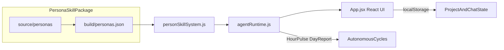
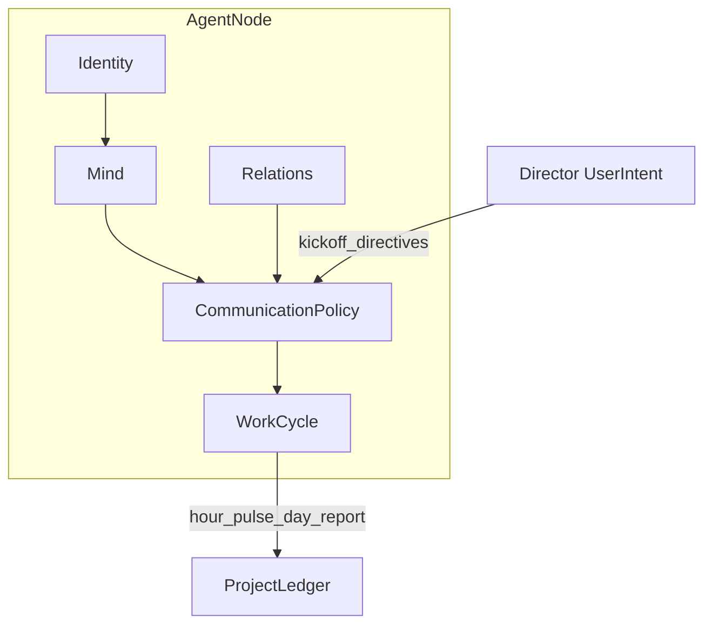

> ## ⚠️ Pre-alpha — Not usable yet / 暂不可用
>
> **This project is under active development and is not ready for real-world use.**  
> Security guarantees are **not in place** — do not deploy for production, team workflows, or sensitive data.
>
> **本项目仍处于早期研发，不可用于真实项目或生产环境。**  
> 安全机制尚未完备，**请暂时不要使用**。
>
> **Current focus:** (1) per-persona skill design · (2) agent collaboration · (3) runtime algorithm  
> **当前阶段：** 人物 Skill 设计 → Agent 协作机制 → 运行算法（详见 **[ROADMAP.md](ROADMAP.md)**）

<p align="center">
  
</p>

<p align="center">
  
  
  
  
  
</p>

# Hall of Fame Studio

> **Hire legendary minds as AI agents, pass a roundtable initiation, then let your virtual team run autonomously under Leader/Reviewer governance.**

Hall of Fame Studio is an open, local-first prototype for a **roundtable-first AI virtual team**. You recruit persona-skilled agents from **The Pantheon**, hold a mandatory kickoff meeting, and watch a governed agent network coordinate work through structured meetings, group chat, and autonomous hour/day cycles — all without shipping your data to a platform API.

---

## See it in action

<table>
  <tr>
    <td align="center" width="50%">
      <br>
      <sub><strong>The Pantheon</strong> — 40 persona dossiers with radar profiles</sub>
    </td>
    <td align="center" width="50%">
      <br>
      <sub><strong>Roundtable kickoff</strong> — no one-click project creation</sub>
    </td>
  </tr>
  <tr>
    <td align="center" width="50%">
      <br>
      <sub><strong>Manager demo path</strong> — assignments, changes, timeline evidence</sub>
    </td>
    <td align="center" width="50%">
      <br>
      <sub><strong>Project workspace</strong> — dashboard, chat, timeline lenses</sub>
    </td>
  </tr>
</table>

---

## Quick start

> **Developer preview only.** Local setup is for UI inspection and validation scripts — not a supported product install. See **[ROADMAP.md](ROADMAP.md)** for milestone status and **[CONTRIBUTING.md](CONTRIBUTING.md)** if you want to contribute.

```bash
git clone https://github.com/MrMaii/Hall-of-Fame-Studio.git
cd Hall-of-Fame-Studio
npm install
npm run dev
```

Open **http://localhost:5173**, then click **Run Manager Demo** on the dashboard to seed the full manager scenario in one click.

### Verify the runtime

```bash
npm run agents:scenario   # End-to-end manager scenario validation
npm run agents:product-team # Generic product-team acceptance sample with submissions, evidence, reviews, HTTP scheduler proof, audit stream, migration dry-run, operations readiness, incident drill, adapter gateway preflight, deployment preflight, project evidence archive, and launch hardening contracts
npm run adapters:gateway-server:validate # Validate the runnable private adapter gateway process plus project API dry-run/preflight routes
npm run adapters:gateway-postgres-store:validate # Validate Postgres-compatible gateway store schema/write/readback parity with a bound query shim
npm run skills:check      # Persona package schema + regression
npm run build             # Production build
```

### Try without cloning

Build a single-file offline demo:

```bash
npm run build:single
# → 单文件版本/hall-of-fame-studio.html
```

Open the generated HTML in any modern browser — no server required.

---

## Features

### The Pantheon — 40 persona skills

Recruit agents inspired by historical and fictional cognitive styles. Each persona ships as a standard skill package with a 10-dimension radar profile, dossier view, and signing ritual.

<p align="center">
  
</p>

- Browse **The Pantheon** talent market
- Inspect dossiers with capability radar charts
- Match personas to task lanes via `personSkillSystem.js`

### Mandatory roundtable initiation

Projects cannot be created with a single click. Every initiative passes through a **roundtable initiation**: name the project, invite agents, hold the war-room meeting, and approve a durable kickoff charter.

<p align="center">
  
</p>

- Structured kickoff speech frames for every participant
- Leader election and role negotiation before work begins
- Role self-nominations and Leader campaign pitches appear as proofed self-marketing nodes in Manager Flow Graph
- Kickoff charter persisted to project state
- Revision notes and final deliverables can link back to Reviewer change requests, superseding earlier drafts with proofed revision edges
- Evidence searches carry source quality signals and aggregate judgement into Dashboard, Flow Graph, and task proof
- Evidence quality audit packages summarize search rows, source quality, source safety, provider provenance, proof routes, and decision gates for Manager review

### Leader / Reviewer governance

The agent network runs under explicit governance: a **Lead** coordinates owners and deadlines; a **Reviewer** challenges evidence and risk. Communication is **attention-scored** — agents speak only when mention, role, or blocker signals cross a threshold.

<p align="center">
  
</p>

- No ownerless tasks, no decisions without recorded reasons
- Collaboration health checks via `evaluateCollaborationState`
- Live Leader `@agent` assignments and peer handoffs in group chat

### Autonomous work cycles

After kickoff, agents advance work through **Hour Pulse** and **Day Report** cycles — updating obligations, publishing only when something changed, and writing to the project ledger.

<p align="center">
  
</p>

- `planAutonomousWorkCycle` + `advanceAutonomousProjectCycle` runtime
- Per-agent state: inbox, obligations, worklog, current plan
- Change ledger for feature requests from chat channels

### BYOK-ready, local-first

All project state and chat messages persist in **browser localStorage** in this prototype. Settings expose API deployment, model routing, evidence provider status, and key management placeholders for future BYOK LLM/search integration — your keys, your infrastructure, your data. The local backend now exposes model/search provider status without returning raw API keys, applies prototype redaction before persisting provider errors, secret-bearing source refs, submissions, reviews, ledger payloads, or artifact drafts, computes source-safety review signals for evidence sources, and exports `GET /projects/:id/security-boundary`, `GET|PUT /projects/:id/membership-policy`, `GET|POST /projects/:id/identity-sessions`, `GET /projects/:id/pilot-launch-readiness`, `GET /projects/:id/deployment-preflight`, `GET|POST /projects/:id/launch-approvals`, `GET /projects/:id/evidence-quality-audit`, `GET /projects/:id/evidence-source-review-workflow`, `GET|POST /projects/:id/project-evidence-exports`, `GET /projects/:id/persistence-snapshot`, `GET /projects/:id/persistence-migration-plan`, `GET /projects/:id/persistence-migration-dry-run`, `GET /projects/:id/persistence-adapter-plan`, `GET /projects/:id/persistence-adapter-dry-run`, `GET /projects/:id/operations-readiness`, `GET /projects/:id/provider-readiness`, `GET /projects/:id/security-access-audit`, and `GET /projects/:id/security-audit-stream` so the Manager Ready Package can show route policy coverage, enforced-mode access policy coverage, optional signed access-header coverage through `AGENT_ACCESS_SIGNING_SECRET`, optional file-backed signed request replay protection through `AGENT_ACCESS_REPLAY_PROTECTION`, optional audit fail-closed behavior through `AGENT_ACCESS_AUDIT_FAIL_CLOSED`, persisted project membership policy coverage with runtime bindings/revocations, local identity-session token-hash coverage through `identity-session/v1`, private-pilot go/no-go status through `pilot-launch-readiness/v1`, deployment preflight status through `deployment-preflight/v1`, launch approval status through `launch-approval-workflow/v1`, evidence quality audit status through `evidence-quality-audit/v1`, evidence source review workflow status through `evidence-source-review-workflow/v1`, project evidence export workflow status through `project-evidence-export-workflow/v1`, local encrypted secret-vault seal/open/rotation receipt status through `SECRET_VAULT_ENABLED`, normalized persistence rows, managed-database migration gates, migration dry-run import checks, managed persistence adapter shadow-read/rollback/backup-restore gates, operations health/recovery gates, local `operations-incident-drill/v1` rehearsal receipts, provider rollout gates, provider policy enforcement status, provider retry/circuit-breaker status, provider usage/cost ledger rows, evidence source-safety summaries, persisted access decisions, backend audit-stream rows with tamper-evident hash-chain verification, append-only JSONL audit sink status, sensitive-field coverage, redaction scan status, and remaining production security/provider blockers.

`GET /projects/:id/production-launch-audit` exposes the unified release audit package. It combines MVP readiness, private-pilot launch readiness, deployment preflight, proof routes, security/provider/operations gates, project evidence handoff status, production blockers, and a checksum so the Manager Ready Package can approve a completed local acceptance project for private pilot while still returning production `no-go` until real managed controls exist. When the core private-pilot gates pass but the evidence package has not been download-audited, `nextShortestPath.scope` points to `private-pilot-handoff`; after `project-evidence-export-package/v1` is ready it returns to `production-hardening`.

`GET /projects/:id/project-evidence-archive` exposes the full `project-evidence-archive/v1`, a manager-verifiable redacted archive contract with manifest checksums for project state, transcripts, submissions, final deliverables, evidence searches, reviews, revision lineage, Flow Graph nodes, Proof Map routes, timeline, event ledger, readiness models, persistence summary, and worker recovery evidence. Manager Ready Package embeds the same archive status, route, gates, manifest, and checksums in manifest-only mode so the dashboard stays responsive while the standalone route remains the complete evidence bundle. It is suitable for private-pilot/customer handoff validation, not a production export system until encrypted object storage, signed/expiring download URL issuance, watermarking, retention enforcement, download audit storage, and data residency controls are added.

`GET /projects/:id/evidence-quality-audit` exposes `evidence-quality-audit/v1`. It aggregates Agent evidence-search rows, per-source quality/safety signals, provider provenance, Readiness Proof Map routes, decision gates, required production controls, and a checksum. Manager Ready Package and the project evidence archive embed the same audit summary so the Manager can see whether current evidence is decision-ready while production remains blocked until real search gateways, calibrated source-quality policy, managed provider/source audit storage, and human review policy exist.

`GET /projects/:id/evidence-source-review-workflow` exposes `evidence-source-review-workflow/v1`. It derives reviewer-visible source review items from the evidence quality audit, preserving source quality/source-safety signals, reviewer handoff, review queue, proof routes, gates, production controls, and checksum. Manager Ready Package, project evidence archive, pilot readiness, production launch audit, access policy, and Manager UI all include the workflow so a product-team decision can show which evidence sources were cleared, queued, or blocked. Production remains blocked until human source-review policy, calibrated source-quality policy, managed source snapshots, provider receipts, and reviewer audit storage exist.

`GET|POST /projects/:id/project-evidence-exports` exposes the private-pilot evidence export governance workflow. It returns `project-evidence-export-workflow/v1`, persists checksummed `project-evidence-export/v1` request/approval/download-audit records, pins each request to the archive checksum generated for that request, requires Manager plus security-admin approval for private-pilot handoff, and mirrors proof into Manager Ready Package, Manager Flow Graph, Readiness Proof Map, timeline, event ledger, security route policy, and the `project_evidence_exports` persistence/migration rows. After approval, `POST /projects/:id/project-evidence-exports` with `action: "download-audit"` returns a local `project-evidence-export-package/v1` descriptor with archive manifest checksums, watermark metadata, retention/data-residency metadata, package gates, and a download-audit receipt; `GET /projects/:id/project-evidence-exports/:exportRequestId/package` reads that descriptor back. Production export remains blocked until real encrypted storage, signed expiring download URL issuance, watermark enforcement, retention deletion, centralized download audit, and data-residency controls exist.

`GET|POST /projects/:id/launch-approvals` exposes the release approval workflow. It persists checksummed Manager/security-admin private-pilot approvals as `launch-approval/v1`, requires operations-owner before production approval, and mirrors approval proof into the event ledger, timeline, Flow Graph, Proof Map, production launch audit, and `launch_approvals` persistence/migration rows.

Worker queue snapshots also expose execution receipts, retry state, and a derived dead-letter queue so the local MVP can prove recovery semantics before a production queue adapter is introduced. The backend now also exposes queue adapter plan/dry-run routes that run a configurable queue adapter facade. The default `WORKER_QUEUE_ADAPTER_DRIVER=local-shadow` executes enqueue, lease, dispatch, receipt ack, retry import, dead-letter recovery, queue inspection, and `worker-queue-adapter-snapshot-parity/v1` snapshot parity locally while keeping production queue cutover blocked. When `WORKER_QUEUE_ADAPTER_DRIVER=http-json` and `WORKER_QUEUE_HTTP_ENDPOINT` or `ADAPTER_GATEWAY_HTTP_ENDPOINT` is configured, `GET /projects/:id/worker-queue-adapter-dry-run` calls the private gateway and returns a gateway execution receipt while still keeping `productionCutoverReady: false`. Managed persistence adapter plan/dry-run routes do the same for the database cutover: they require table coverage for membership, replay, audit, provider, worker, and read-model records, then run a configurable adapter facade. The default `MANAGED_PERSISTENCE_ADAPTER_DRIVER=local-shadow` executes connect, schema creation, import, shadow-read parity, transaction rollback, backup/restore, RLS coverage, and audit-stream continuity locally while keeping production cutover blocked. When `MANAGED_PERSISTENCE_ADAPTER_DRIVER=http-json` and `MANAGED_PERSISTENCE_HTTP_ENDPOINT` or `ADAPTER_GATEWAY_HTTP_ENDPOINT` is configured, `GET /projects/:id/persistence-adapter-dry-run` sends the current project snapshot and migration plan to the gateway and returns the external receipt. `postgres` / `managed-queue` still require future real drivers.

`npm run adapters:gateway` starts local mock `http-json` adapter gateways, verifies the shared health, persistence dry-run, and worker-queue dry-run receipt contract, then creates a backend project and proves the API dry-run routes can execute through that gateway. It is a contract test for future external adapters, not evidence that production persistence or queue infrastructure has been deployed.

`npm run adapters:gateway-server` starts a local private adapter gateway reference process. It exposes `GET /health`, `GET /state`, `POST /persistence/dry-run`, and `POST /worker-queue/dry-run`, stores imported shadow table records, queue rows, lease/dead-letter state, and receipt summaries through the `ADAPTER_GATEWAY_STORAGE_DRIVER` adapter, and can require `ADAPTER_GATEWAY_AUTH_TOKEN`. The default storage driver is `json-file` with `ADAPTER_GATEWAY_STORE`; `memory` is available for ephemeral validation; `postgres` / `postgres-compatible` exposes a Postgres schema/upsert/snapshot write plan using `ADAPTER_GATEWAY_POSTGRES_URL` and `ADAPTER_GATEWAY_POSTGRES_SCHEMA`. `GET /projects/:id/adapter-gateway-preflight` now proves the product backend can read the gateway's live health, advertised capabilities, and state summary before dry-run cutover, while still keeping `productionCutoverReady: false`. `npm run adapters:gateway-server:validate` proves the runnable process satisfies the shared gateway contract and can be used by project API dry-run and preflight routes. `npm run adapters:gateway-postgres-store:validate` binds the Postgres-compatible driver to a fake query function and verifies schema-plan, table-record, queue-row, lease, dry-run receipt, state snapshot, and readback parity operations. This is the deployable process shape for private pilots, while real production still needs a managed Postgres client, real database readback, durable queue leases, KMS, audit, backup/restore rehearsal, and monitoring.

---

## Architecture





| Layer | Path | Responsibility |
|-------|------|----------------|
| UI | `src/App.jsx` | Dashboard, Pantheon, war room, project workspace |
| Agent runtime | `src/agents/agentRuntime.js` | Meetings, chat routing, autonomous cycles |
| Persona bridge | `src/skills/personSkillSystem.js` | Task matching, roundtable plans |
| Skill package | `skills/hall-of-fame-personas/` | Canonical persona source + build pipeline |

Deep dive: [`src/agents/README.md`](src/agents/README.md)

---

## Project structure

```
hall-of-fame-studio/
├── src/
│   ├── App.jsx                 # Main React UI
│   ├── agents/agentRuntime.js  # Agent collaboration engine
│   └── skills/personSkillSystem.js
├── skills/hall-of-fame-personas/   # 40 persona skill packages
├── scripts/
│   ├── validate-agent-manager-scenario.mjs
│   └── build-single-html.cjs
├── docs/assets/                # README visuals (hero, demos, features)
├── PRD.md                      # Product requirements (Chinese)
└── 人物市场.md                  # Persona market reference (Chinese)
```

---

## Development

| Command | Description |
|---------|-------------|
| `npm run dev` | Start Vite dev server |
| `npm run build` | Production build to `dist/` |
| `npm run build:single` | Single-file HTML for offline demo |
| `npm run agents:scenario` | Validate manager demo data path |
| `npm run agents:product-team` | Validate generic product-team acceptance path with Agent submissions, evidence searches, reviews, HTTP scheduler proof, MVP readiness, pilot launch readiness, adapter gateway preflight, deployment preflight, launch approvals, production launch audit, evidence quality audit, project evidence archive, project evidence export workflow and local package receipt, enforced/signed/replay-protected/audit-fail-closed/project-membership access decisions, local identity-session issue/use/revoke proof, persisted membership policy revisions, local secret-vault seal/open/rotation proof, access audit stream, security boundary, persistence snapshot, managed migration plan, migration dry-run verifier, managed persistence adapter plan/dry-run checks, operations readiness with incident drill receipts, provider readiness, provider policy/usage ledger, worker queue snapshots with execution receipts, and queue adapter plan/dry-run checks |
| `npm run adapters:gateway` | Validate the shared `http-json` adapter gateway contract with a local mock gateway for persistence and worker queue receipts |
| `npm run adapters:gateway-server` | Start the local private adapter gateway reference process for persistence and queue dry-run receipts |
| `npm run adapters:gateway-server:validate` | Validate the runnable private adapter gateway process, bearer auth, shadow table/queue persistence, leases, project API dry-run integration, and live adapter gateway preflight |
| `npm run adapters:gateway-postgres-store:validate` | Validate the Postgres-compatible gateway store schema plan, query-bound write operations, and readback parity without claiming real database cutover |
| `npm run skills:validate` | Persona schema validation (Python) |
| `npm run skills:regression` | Persona ranking regression (Python) |
| `npm run skills:check` | Both skill validations |
| `npm run readme:assets` | Re-capture demo screenshots + GIFs |

### Regenerate README visuals

With the dev server running (`npm run dev`):

```bash
npm run readme:assets
```

This captures fresh screenshots from the live app and rebuilds demo GIFs in `docs/assets/`.

---

## Documentation

- **[Development Roadmap (ROADMAP.md)](ROADMAP.md)** — milestone plan, current phase, contributor entry points (Chinese)
- **[Contributing (CONTRIBUTING.md)](CONTRIBUTING.md)** — what to work on now, PR expectations
- [Product Requirements (PRD)](PRD.md) — full product spec (Chinese)
- [Technical Overview](TECHNICAL.md) — Agent agency, flow-graph submissions, queues, backend Harness
- [Agent Architecture](src/agents/README.md) — five-layer agent model, meeting protocols, autonomous cycles
- [Persona Skill Bridge](src/skills/README.md) — how the app connects to the skill package
- [Persona Skill System (人物Skill系统.md)](人物Skill系统.md) — per-persona skill design spec (Chinese)
- [Persona Market Reference (人物市场.md)](人物市场.md) — persona categories and slugs (Chinese)
- [Image Attribution](IMAGE_ATTRIBUTION.md) — Wikimedia Commons avatar licensing

---

## Credits

- **Persona avatars** sourced from [Wikimedia Commons](https://commons.wikimedia.org/) — see [IMAGE_ATTRIBUTION.md](IMAGE_ATTRIBUTION.md)
- **Persona skills** authored under `skills/hall-of-fame-personas/source/personas/`
- **Fonts** — EB Garamond & Space Mono via Google Fonts

---

## License

License TBD. This repository is a product prototype; confirm licensing before redistribution.
