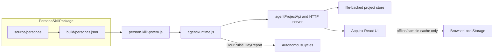
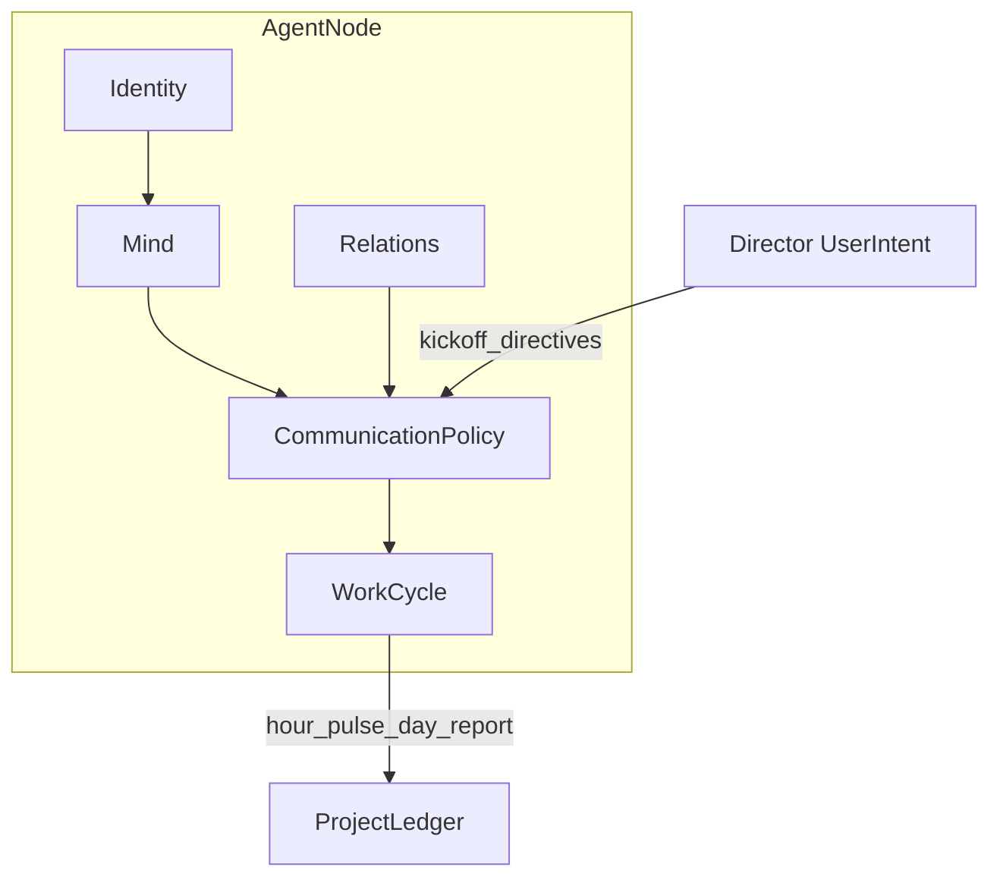

> ## ⚠️ Private MVP — Public production blocked / 私有 MVP，可公开生产仍阻塞
>
> **This project is ready for local backend MVP validation and controlled private-pilot rehearsal, not public production.**
> Do not deploy it for unattended production, unmanaged sensitive data, or customer production traffic until managed secrets, persistence, queue/cron, observability, audit, incident response, provider/BYOK controls, and production policy gates are proven.
>
> **本项目可用于本地后端 MVP 验证与受控私有试点 rehearsal，但不可公开生产上线。**
> 在 managed secrets、持久化、队列/cron、集中观测、审计、事故恢复、provider/BYOK 控制和生产策略门禁补齐前，不要用于无人值守生产、未批准敏感数据或客户生产流量。
>
> **Current status:** P0 local backend MVP verified · P1 private-pilot rehearsal gated · P2 public production blocked
> **当前阶段：** P0 本地后端 MVP 已可验证 · P1 私有试点 rehearsal 已有门禁 · P2 公开生产仍 blocked（详见 **[ROADMAP.md](ROADMAP.md)**）

<p align="center">
  
</p>

<p align="center">
  
  
  
  
  
</p>

# Hall of Fame Studio

> **Hire legendary minds as AI agents, pass a roundtable initiation, then let your virtual team run autonomously under Leader/Reviewer governance.**

Hall of Fame Studio is an open, local-first prototype for a **roundtable-first AI virtual team**. You recruit persona-skilled agents from **The Pantheon**, hold a mandatory kickoff meeting, and watch a governed agent network coordinate work through structured meetings, group chat, and autonomous hour/day cycles — all without shipping your data to a platform API.

---

## See it in action

<table>
  <tr>
    <td align="center" width="50%">
      <br>
      <sub><strong>The Pantheon</strong> — 40 persona dossiers with radar profiles</sub>
    </td>
    <td align="center" width="50%">
      <br>
      <sub><strong>Roundtable kickoff</strong> — no one-click project creation</sub>
    </td>
  </tr>
  <tr>
    <td align="center" width="50%">
      <br>
      <sub><strong>Manager sample fixture</strong> — assignments, changes, timeline evidence</sub>
    </td>
    <td align="center" width="50%">
      <br>
      <sub><strong>Project workspace</strong> — dashboard, chat, timeline lenses</sub>
    </td>
  </tr>
</table>

---

## Quick start

> **Developer preview only.** Local setup is for UI inspection and validation scripts — not a supported product install. See **[ROADMAP.md](ROADMAP.md)** for milestone status and **[CONTRIBUTING.md](CONTRIBUTING.md)** if you want to contribute.

```bash
git clone https://github.com/MrMaii/Hall-of-Fame-Studio.git
cd Hall-of-Fame-Studio
npm install
npm run dev
```

Open **http://localhost:5173**, then click **Load Sample Fixture** on the dashboard to inspect the Manager Demo sample data. Real project work should start from the initiation workflow, not the sample fixture.

### Verify the runtime

```bash
npm run agents:scenario   # End-to-end manager scenario validation
npm run agents:product-team:research-sample # Fast Research-as-validation-sample gate for the generic product-team delivery trace
npm run agents:product-team # Generic product-team acceptance sample with submissions, evidence, reviews, HTTP scheduler proof, audit stream, migration dry-run, operations readiness, incident drill, adapter gateway preflight, deployment preflight, project evidence archive, and launch hardening contracts
npm run adapters:gateway-server:validate # Validate the runnable private adapter gateway process plus project API dry-run/preflight routes
npm run adapters:gateway-postgres-store:validate # Validate Postgres-compatible gateway store schema/write/readback parity with a bound query shim
npm run skills:check      # Persona package schema + regression
npm run build             # Production build
```

### Try without cloning

Build a single-file offline demo:

```bash
npm run build:single
# → 单文件版本/hall-of-fame-studio.html
```

Open the generated HTML in any modern browser — no server required.

---

## Features

### The Pantheon — 40 persona skills

Recruit agents inspired by historical and fictional cognitive styles. Each persona ships as a standard skill package with a 10-dimension radar profile, dossier view, and signing ritual.

<p align="center">
  
</p>

- Browse **The Pantheon** talent market
- Inspect dossiers with capability radar charts
- Match personas to task lanes via `personSkillSystem.js`

### Mandatory roundtable initiation

Projects cannot be created with a single click. Every initiative passes through a **roundtable initiation**: name the project, invite agents, hold the war-room meeting, and approve a durable kickoff charter.

<p align="center">
  
</p>

- Structured kickoff speech frames for every participant
- Leader election and role negotiation before work begins
- Role self-nominations and Leader campaign pitches appear as proofed self-marketing nodes in Manager Flow Graph
- Kickoff charter persisted to project state
- Kickoff generation provenance labels deterministic validation, model-provider rehearsal, provider-backed model generation, or development fallback in both initiation and the approved project Dashboard while keeping production claims blocked
- Revision notes and final deliverables can link back to Reviewer change requests, superseding earlier drafts with proofed revision edges
- Evidence searches carry source quality signals and aggregate judgement into Dashboard, Flow Graph, and task proof
- Evidence quality audit packages summarize search rows, source quality, source safety, provider provenance, proof routes, and decision gates for Manager review

### Leader / Reviewer governance

The agent network runs under explicit governance: a **Lead** coordinates owners and deadlines; a **Reviewer** challenges evidence and risk. Communication is **attention-scored** — agents speak only when mention, role, or blocker signals cross a threshold.

<p align="center">
  
</p>

- No ownerless tasks, no decisions without recorded reasons
- Collaboration health checks via `evaluateCollaborationState`
- Live Leader `@agent` assignments and peer handoffs in group chat

### Autonomous work cycles

After kickoff, agents advance work through **Hour Pulse** and **Day Report** cycles — updating obligations, publishing only when something changed, and writing to the project ledger.

<p align="center">
  
</p>

- `planAutonomousWorkCycle` + `advanceAutonomousProjectCycle` runtime
- Per-agent state: inbox, obligations, worklog, current plan
- `agent-autonomous-strategy-decision/v1` records why an Agent worker chooses review response, teammate review, completed-work submission, management response, continued work, or monitoring
- `GET|POST /projects/:id/agent-autonomous-action-queue` turns those strategy decisions into a backend-readable and executable queue, so Manager Dashboard, Readiness Proof Map, and Manager Flow Graph can show the Agent's selected next action before it is run
- Bounded Autopilot sessions now read the generic Product Team Delivery Trace, convert the next missing stage into target controls, inject those controls into the delegated execution payload, and persist run/loop/session receipts for Dashboard, Flow Graph, Proof Map, and Agent Dashboard traceability
- `POST /workers/autopilot/due` can advance active bounded Autopilot sessions from the backend scheduler path. Worker Queue Snapshot exposes those sessions as `autopilot-session` rows with idempotency, lease, direct tick, and proof refresh contracts; completed session ticks now export `worker-execution-receipt/v1` rows into `worker_runs`, file-backed restart can reload and resume active sessions through the due-worker, and queue adapter plan/dry-run plus the private adapter gateway import, lease, dispatch, acknowledge, and parity-check that Autopilot lane alongside project and Agent workers
- The React Backend Worker Station now makes that scheduler path the main Autopilot continuation control: `Scheduler Tick` calls `/workers/autonomous/tick` with Autopilot enabled, then shows the `/workers/autopilot/due` worker receipt while keeping `Direct Tick` as a manual diagnostic fallback
- Autonomous Run Control action, loop, session, tick, pause, and due-worker writes now have a dedicated deferred read-model contract. With `includeReadModels: false`, they return routes for sessions, active tick/pause, scheduler tick, Autopilot due-worker, Agent queue, operating loop, cycle consistency, Flow Graph, Proof Map, timeline, events, and transcripts; React consumes those routes after Autopilot commands instead of inferring session state from browser memory
- Backend Worker Station `Start` now lets the backend own the immediate project pulse and per-Agent startup sweep, then the UI reads back project/Manager/queue state; this avoids parallel browser pulse writes overwriting Agent worker ledger proof
- Agent due-worker and HTTP scheduler tick/start responses now include the post-run Agent autonomous action queue, so C-side scheduler controls can display the A-side next-action state immediately after backend work advances
- The Manager UI can sync and run that Agent queue through the backend, then refresh Agent/Manager read models from receipts instead of inferring local worklog state
- Change ledger for feature requests from chat channels

### BYOK-ready, local-first

Frontend mock replacement is now treated as a backend contract problem, not a visual cleanup task. Project initiation/kickoff approval, Agent evidence-search, submission, and artifact-draft routes plus Manager command/walkthrough/action, chat/meeting/change, autonomous-cycle, Autonomous Run Control, Autopilot due-worker, security membership/session, and production-control receipt routes support `includeReadModels: false`; they return a lightweight backend receipt plus explicit project/transcript/Manager/Agent/security/autonomy/launch-control read-model refresh routes. The React initiation approval, Agent Focus Workbench, and Autopilot controls consume these paths for project entry, evidence, typed submissions, draft+submit actions, session/tick state, operating-loop proof, and cycle-consistency proof; real backend-online projects should refresh Manager Dashboard, Manager Ready Package, Manager Flow Graph, Agent Dashboard, and production launch/control read models instead of generating local rows. Chat, meeting, Manager change, Leader assignment, and direct Hour/Day pulse controls now fail closed for backend-online real projects: if the backend command fails, the UI shows the failure instead of mutating browser-local state.

`POST /product-team-missions` is the current one-call backend bridge from a customer goal to a running generic AI product team. It can create a durable kickoff meeting or reuse the meeting the customer just approved, confirms the Leader/Reviewer/next actions, approves the project, starts a bounded Autopilot session, optionally runs the first A-side tick, and persists `product-team-mission-run/v1`. The React initiation approval now posts to this route, so C-side project start records a Mission Runner receipt instead of stopping at the older kickoff/initiate receipt. The Manager Dashboard renders that receipt with reused-kickoff status, Leader/Reviewer, Autopilot session/tick state, proof routes, and direct chat/timeline/Flow Graph proof exits. The receipt is also visible through `GET /projects/:id/product-team-missions`, Manager Flow Graph, and Readiness Proof Map, with routes back to transcripts, Product Team Delivery Trace, Product Team Operating Loop, Collaboration Intent Queue, and Autonomous Run Control. This is a general product-team mission runner; a Research Project brief is only a validation sample.

`GET /projects/:id/planner-executor-reviewer-state-machine` is the Manager-readable responsibility handoff contract. It proves whether the Planner lane created kickoff/role proof, the Executor lane produced brainstorm/evidence/draft artifacts, and the Reviewer lane closed requested changes into revision plus accepted final delivery. Manager Ready Package, Manager Flow Graph, Readiness Proof Map, and React proof sync consume the same `planner-executor-reviewer-state-machine/v1` model, so the flowchart can show responsibility handoff from backend evidence instead of frontend labels.

`npm run ui:manager-private-pilot` is the C-side private-pilot handoff and closeout gate. It first prepares the generic product-team acceptance project through `npm run agents:product-team:private-pilot:launch-handoff`, using an isolated `.tmp/product-team-acceptance/<run-id>` backend store/runtime checkpoint instead of the shared acceptance store, then opens the real browser UI, syncs the backend project, records Manager/security launch approvals, requests and approves the project evidence export, records the download audit, clicks the four Manager Ready Package receipt buttons for release candidate, launch run, launch health, and customer acceptance, and verifies Manager Flow Graph plus Readiness Proof Map evidence after those clicks. Product-team stage workspaces are cleaned by default after the run; use `HOFS_PRODUCT_TEAM_PRESERVE_TMP=1` or `HOFS_MANAGER_PRIVATE_PILOT_PRESERVE_TMP=1` only for focused debugging.

`docs/LAUNCH_READINESS_GATES.md` is the operational launch gate matrix. It separates P0 local backend MVP, P1 customer private pilot, and P2 public production; lists the exact validation commands for each tier; and keeps public production blocked until managed persistence, queue/cron, BYOK/provider, security, operations, evidence export, and launch-governance controls are proven. `npm run launch:gates` verifies the matrix stays tied to runnable package scripts, while `npm run launch:infra` runs the P2 infrastructure rehearsal for the public-production startup blocker contract, adapter gateway, reference private gateway server, Agent HTTP server env-gateway mode, and Postgres-compatible storage boundary.

Current project persistence direction: browser `localStorage` is now an offline/cache fallback, not the target source of truth for backend-online projects. The React dashboard can sync `GET /projects`, open projects through `GET /projects/:id`, refresh group-chat transcripts through `GET /projects/:id/transcripts` and channel transcript routes, refresh workflow proof through `GET /projects/:id/timeline` and `GET /projects/:id/events`, refresh core proof submodels through standalone brainstorm/artifact/review/evidence/custody routes, and run full Ready Package proof-model syncs across pilot/launch/production-control/provider/operations/persistence/queue/security routes. Browser snapshot writes are limited to explicit demo/sample or development-fallback projects; real backend projects must mutate through backend command/receipt routes. Browser-local runtime fallback for failed write commands is limited to offline mode, explicit demo/sample projects, or development-build-only `__HOF_ALLOW_LOCAL_RUNTIME_FALLBACK__` / `hall_of_fame_studio.dev_local_runtime_fallback.v1` / `VITE_HOFS_ALLOW_LOCAL_RUNTIME_FALLBACK=true` switches; production builds ignore those development switches.

For backend-online real projects, absent production launch/control/evidence/receipt read models now render as `backend-model-missing` / `backend-required` instead of frontend-synthesized production rows. Derived production fallback rows are limited to offline and explicit demo/sample use, so the Manager UI does not overstate C-side readiness when the A-side backend has not produced the contract.

Backend-online real projects now treat the local backend store as the canonical project state. Browser `localStorage` remains an offline/sample cache for UI settings, explicit demo fixtures, and development fallbacks; real projects should move through backend command routes, receipt rows, read-model refresh routes, transcript/timeline/event ledgers, and file-backed persistence. Settings exposes backend-owned deployment/model/provider boundaries, lets a Manager submit model/search API keys only through `POST /secret-vault/seal` after the backend vault reports ready, clears plaintext after submission, writes project language, workspace policy, the local MVP privacy policy, the project provider budget policy, and the project Agent tool grant policy through `project-settings/v1`, and renders Workspace/Integrations controls as backend contracts instead of browser-local memory, Proxy/Webhook, MCP, vector-store, budget-alert, or error-reporting controls.

The API fields can be typed in Settings, but `Seal` stays disabled until backend `settings-provider-readiness/v1` reports `canSealSecrets: true`; provider secrets are never saved as browser-local configuration. `project-settings/v1` now also exposes `project-integration-capabilities/v1`, so Settings Integrations can show provider budget and Agent tool grants as backend-backed editable controls while Proxy/Webhook, MCP Tools, Vector Store, Budget Alerts, and Error Reporting are backend-backed read-only route contracts with production blockers instead of fake inputs or missing backend APIs. `GET /projects/:id/settings-integration-readiness` aggregates those rows as `settings-integration-readiness/v1`, embeds the result in Manager Ready Package as `settingsIntegrationReadiness`, and exposes `settingsIntegrationReadinessRoutes` in Readiness Proof Map so the Integrations tab is a backend readiness surface, not a route list or browser mock. It also exposes `project-workspace-policy/v1` plus `project-workspace-capabilities/v1`, so Settings Workspace can show global interface language as browser-local; project language, interface density, default visibility, autosave cadence, runtime contract rules, long-term memory readiness, and meeting summaries as backend-backed instead of fake editable controls.

Runtime contract rules point to `GET /projects/:id/runtime-contracts`, which returns `runtime-contract-freeze/v1` for local MVP Agent autonomy, submission, evidence, review, transcript, Flow, and Proof contracts while production contract approval remains blocked. Long-term memory points to `GET /projects/:id/memory-readiness`, which returns `project-memory-readiness/v1` over project state, transcripts, meeting summaries, evidence/artifact index proof, and persistence adapter planning; Settings renders and syncs that read model as a read-only memory readiness panel, and Manager Ready Package / Readiness Proof Map now expose the same memory readiness route as formal proof instead of leaving it as a Settings-only surface. Managed database/vector memory, retention/deletion policy, restore drills, and customer export controls remain production blockers. The meeting summary route derives `meeting-summaries/v1` from backend transcripts, timeline logs, and event-ledger proof; it proves local MVP meeting-summary visibility but remains production-blocked until summary provenance, transcript retention, and human review policy are managed. The Proxy/Webhook row now points to `GET /projects/:id/adapter-gateway-preflight`, where `adapter-gateway-preflight/v1` proves the local/private adapter rehearsal path while production adapter cutover stays blocked. The MCP Tools row points to `GET /projects/:id/provider-readiness`, keeping tool adapters behind provider policy, Agent grants, and runtime identity until a managed registry exists. The Vector Store row now points to `GET /projects/:id/evidence-index-readiness`, where `evidence-index-readiness/v1` proves local evidence searches, source snapshots, provider receipts, Agent submissions, and artifact storage proofs can be indexed for local MVP inspection while managed vector memory stays production-blocked. The Budget Alerts row now points to `GET /projects/:id/budget-alert-readiness`, where `budget-alert-readiness/v1` computes local daily budget and hourly request headroom from backend provider policy plus usage ledger while centralized alert routing stays production-blocked. The Error Reporting row now points to `GET /projects/:id/error-reporting-readiness`, where `error-reporting-readiness/v1` exposes local log streams, alert rules, recovery runbook, incident-drill status, and error-signal counts while centralized logs/traces remain production-blocked. The local backend exposes redacted provider/model/search status, source-safety and provider receipt proof, route policy coverage, membership/identity-session contracts, evidence/artifact/review/custody workflows, private-pilot launch and handoff workflows, operations/provider/security/persistence/queue readiness, and production-control receipt contracts. These routes make Manager Ready Package, Manager Flow Graph, Readiness Proof Map, Agent Dashboard, and launch-control surfaces consume backend evidence instead of browser-generated rows while keeping public production blocked until real managed controls exist.

Budget alert readiness is now part of that formal proof surface: Manager Ready Package embeds `budgetAlertReadiness`, and Readiness Proof Map exposes `budgetAlertReadinessRoutes`, so local cost-control evidence is not limited to a Settings integration row.

Error reporting readiness is also part of that formal proof surface: Manager Ready Package embeds `errorReportingReadiness`, and Readiness Proof Map exposes `errorReportingReadinessRoutes`, so local log/error proof is not limited to a Settings integration row.

Settings provider/runtime readiness is also part of that formal proof surface: Manager Ready Package embeds `settingsProviderReadiness` and `settingsRuntimeReadiness`, and Readiness Proof Map exposes `settingsProviderReadinessRoutes` and `settingsRuntimeReadinessRoutes`, so API-key entry, Seal availability, Deployment runtime rows, and Models runtime rows are not limited to local Settings UI state.

To make Settings provider entry usable in local development, start the backend with Secret Vault env before opening the UI: set `SECRET_VAULT_ENABLED=true`, set `SECRET_VAULT_KEY`, then run `npm run agents:server`. The Settings Keys tab will stay backend-required and disable sealing until `/secret-vault/status` is ready. When a Manager seals `model.apiKey`, `search.apiKey`, or `search.endpoint`, the backend binds that secret into the running provider as `local-secret-vault` instead of only writing a vault record. Model calls can become callable immediately when no policy block is configured. Search becomes callable only after a deterministic provider or a real `http-json` endpoint is configured; the UI can now seal the search endpoint and key through the same backend Vault route, then `/search/test` can verify the gateway. `agents:server` stores encrypted vault records in `.tmp/agent-secret-vault-records.json` by default, or in `SECRET_VAULT_RECORDS_FILE` when configured, so local restarts can reload sealed keys/endpoints as long as the same `SECRET_VAULT_KEY` is supplied. Run `npm run agents:server:validate` for the model-key startup path and `npm run agents:search-provider:vault-endpoint` for the search endpoint/key path.

`GET /local-mvp-startup-readiness` exposes `local-mvp-startup-readiness/v1`, the global backend startup preflight for local MVP use. It aggregates Secret Vault readiness, model/search runtime status, provider-vault redaction, project catalog readability, next action, and validation commands before the UI claims a user can begin a local product-team session. Manager Ready Package embeds `localMvpStartupReadiness`, and Readiness Proof Map exposes `localMvpStartupReadinessRoutes`, so first-run blockers are visible in the project proof surface. Run `npm run agents:local-mvp-startup-readiness` to verify the route moves from Vault-required to provider-setup-required without leaking provider secrets or claiming production readiness.

`GET /public-production-startup-readiness` exposes `public-production-startup-readiness/v1`, the global backend startup preflight for public production traffic. It checks enforced signed access, replay protection, audit fail-closed mode, managed Secret Manager/KMS, managed persistence, managed worker queue, provider redaction, adapter gateway attestation, centralized observability, alert routing, on-call ownership, managed incidents, restore drill proof, and centralized audit retention. Settings runtime, Manager Ready Package, Readiness Proof Map, the project-level Production Launch Control Center, and the Manager UI link this route so local runtime readiness cannot be mistaken for public launch readiness. Run `npm run agents:public-production-startup-readiness` to verify the current backend stays public-production blocked without leaking provider secrets.

`GET /settings/health-readiness` exposes `settings-health-readiness/v1`, the backend-owned Settings Quick Check contract. It lists backend API, local MVP startup, Secret Vault, model/search provider status, explicit provider test routes, worker status route, project catalog, validation commands, and production blockers without spending provider calls or creating a probe project. Manager Ready Package embeds `settingsHealthReadiness`, and Readiness Proof Map exposes `settingsHealthReadinessRoutes`, so Settings health is auditable as a project startup gate. Run `npm run agents:settings-health-readiness` to verify the contract with and without a local Secret Vault and after sealing a model key.

`GET /settings/runtime-readiness` and `GET /projects/:id/settings-runtime-readiness` expose `settings-runtime-readiness/v1`, the backend-owned Deployment/Models runtime contract. It aggregates model/search runtime status, provider-vault binding proof, worker status route, local persistence adapter status, worker queue adapter status, deployment preflight route, validation commands, and production blockers so Settings does not infer deployment or model readiness in the browser. Manager Ready Package embeds `settingsRuntimeReadiness`, and Readiness Proof Map exposes `settingsRuntimeReadinessRoutes`. Run `npm run agents:settings-runtime-readiness` to verify the global and project-scoped contracts without launching a browser or calling providers.

`src/agents/modelProvider.js` exposes the local BYOK model-provider adapter contract. `model-provider-adapter-manifest/v1` lists the OpenAI-compatible, OpenAI, Anthropic, and Gemini adapter styles, their supported operations, and their secret-name inputs without exposing keys. Run `npm run agents:model-provider-adapter` to verify adapter selection, OpenAI-compatible request/response mapping, missing-key fail-closed behavior, and status redaction without launching a browser or calling a real provider.

`GET /projects/:id/settings-integration-readiness` exposes `settings-integration-readiness/v1`, the backend-owned Settings Integrations contract. It aggregates project integration capabilities, provider budget policy, Agent tool grants, adapter gateway preflight, provider readiness, evidence index readiness, budget alert readiness, and error reporting readiness into one project-scoped UI/readiness packet. Manager Ready Package embeds `settingsIntegrationReadiness`, and Readiness Proof Map exposes `settingsIntegrationReadinessRoutes`. Run `npm run agents:settings-integration-readiness` to verify the aggregate route, Manager proof surfaces, route-backed rows, and production-blocked status without launching a browser.

Run `npm run ui:settings-agents-server` when changing Settings, backend startup, or Secret Vault behavior. It opens the built React UI against the real `agents:server` process and proves the Settings Keys tab can seal model key plus search endpoint/key through the documented backend path.

`GET|POST /projects/:id/production-deployment-control-receipts` is the deployment counterpart to the existing operations/security/provider receipt routes. It exposes `production-deployment-control-receipt-workflow/v1`, records checksummed `production-deployment-control-receipt/v1` evidence, projects verified deployment receipts into the `production-infrastructure-rehearsal/v1` deployment domain, renders the Manager UI deployment receipt card, and exports `production_deployment_control_receipts` persistence/migration rows.

`GET /projects/:id/mvp-readiness` exposes `product-team-mvp-readiness/v1`, the local MVP launch gate. It now includes routed `operatorActions` plus `nextShortestPath` with method, owner, API path, run path, and production-blocker flags, so the Manager can see whether the shortest path is closing a core loop gap, preparing private-pilot handoff, or hardening a production blocker without confusing local MVP readiness with public production readiness. Core-gap operator actions can also carry an `autopilot-delivery-target-control/v1` target, which turns the C-side choice into a Collaboration Intent Queue row and a runnable `run-mvp-readiness-target` Autonomous Run Control action until that gap closes. Running that action delegates to the A-side Agent queue and produces the requested submission/review node, including brainstorm board, evidence packet, product brief, requested-changes review, linked revision note, final deliverable, and final acceptance evidence, with chat, timeline, event, workspace, Flow Graph, and Proof Map proof. `POST /projects/:id/mvp-readiness/operator-actions/:actionId/run` records `mvp-readiness-operator-action-run/v1` receipts into the project ledger, timeline, Flow Graph, and Readiness Proof Map while preserving production-blocker context; production-hardening receipts remain non-autonomous.

`GET /projects/:id/production-launch-audit` exposes the unified release audit package. It combines MVP readiness, private-pilot launch readiness, deployment preflight, proof routes, security/provider/operations gates, project evidence handoff status, production evidence integrity, production blockers, and a checksum so the Manager Ready Package can approve a completed local acceptance project for private pilot while still returning production `no-go` until real managed controls exist. When the core private-pilot gates pass but the evidence package has not been download-audited, `nextShortestPath.scope` points to `private-pilot-handoff`; after `project-evidence-export-package/v1` is ready it returns to `production-hardening`.

`GET /projects/:id/production-launch-gap-register` exposes `production-launch-gap-register/v1`, a Manager-readable action register for the remaining public-production launch work. It normalizes blockers from production launch audit, production evidence integrity audit, deployment preflight, production operations readiness, provider readiness, evidence custody, artifact quality, and submission review governance into deduplicated gap rows with domain, owner, severity, action, route, proof ids, timeline/event ids, upstream checksums, and next action. Manager Ready Package embeds it, Manager Flow Graph adds a gap-register decision node, Readiness Proof Map exposes `productionLaunchGapRoutes`, Security Boundary lists the route policy, and Manager UI renders the gap register. It is a planning and accountability surface; it keeps `readyForProduction: false` until real managed controls close.

`GET /projects/:id/production-launch-control-center` exposes `production-launch-control-center/v1`, a Manager-facing public-production release control view. It aggregates the launch audit, gap register, private-pilot go-live state, global public-production startup readiness, production operations receipts, production deployment receipts, production security receipts, production provider receipts, production evidence integrity audit, launch approvals, deployment preflight, provider readiness, security boundary, custody, and artifact quality into control rows, blocked rows, owner rows, stage rows, next action, proof ids, timeline/event ids, upstream checksums, and checksum. Manager Ready Package embeds it, Manager Flow Graph adds a control-center decision node, Readiness Proof Map exposes `productionLaunchControlCenterRoutes`, Security Boundary lists the route policy, and Manager UI renders the control center. It is read-only and keeps `productionDecision: no-go` until all real production controls, managed-production evidence, public startup gates, and approvals close.

`GET /projects/:id/production-launch-evidence-dossier` exposes `production-launch-evidence-dossier/v1`, a Manager-readable launch evidence package that turns the production launch audit, gap register, control center, evidence integrity audit, private-pilot go-live state, deployment/security/provider/operations readiness, and production receipt workflows into one manifest. It lists every evidence route, four production control domains, remaining gaps, proof/timeline/event ids, checksums, and the current `productionDecision`. Manager Ready Package embeds it, Manager Flow Graph adds a dossier node fed by the control center, gap register, and evidence integrity audit, Readiness Proof Map exposes `productionLaunchEvidenceDossierRoutes`, Security Boundary lists the route policy, and Manager UI renders the dossier. It is an audit package for launch review; it keeps `readyForProduction: false` until real managed-production evidence and all release gates close.

`GET /projects/:id/production-evidence-integrity-audit` exposes `production-evidence-integrity-audit/v1`, a read-only audit over production operations, deployment, security, and provider control receipts. It classifies every required control as `missing`, `local-rehearsal`, `external-unattested`, or `managed-production`, surfaces domain rows, proof ids, timeline/event ids, backend routes, summary counts, and checksum, feeds the production launch audit and production launch gap register, appears in Manager Flow Graph / Readiness Proof Map, and renders in the Manager UI. The product-team Harness now verifies both sides of the guardrail: local `.test` receipt evidence stays blocked, unsigned `evidenceEnvironment: "managed-production"` claims remain `external-unattested`, and only managed-production receipts with a valid attestation signature can make this evidence audit production-evidence-ready and close the matching launch-audit/gap-register row. This prevents local rehearsal receipts or hand-labeled claims from being mistaken for a public-production certificate.

The adapter gateway is now the first backend control-plane signer for that boundary. `POST /attestations/managed-production-control` can issue `adapter-gateway-managed-production-control-attestation/v1` only after a query-bound Postgres-compatible store proves readback parity, and the signature is checked against the same evidence-integrity payload. This is infrastructure rehearsal evidence; real public production still requires the route to be backed by a managed database, durable queue/cron, KMS/Secret Manager, centralized audit, and operations controls.

`POST /projects/:id/managed-infrastructure-cutover-attestations` is the project-level bridge from that private adapter gateway signer into Manager-visible launch proof. It fails closed when the gateway is missing, readback parity is not ready, or the gateway has no project dry-run receipt evidence, then requests signed attestations for `managed-persistence-cutover` and `managed-worker-queue-cutover`, writes them into `production-operations-control-receipt/v1`, and refreshes Production Infrastructure Rehearsal / Evidence Integrity proof without marking the whole product public-production ready.

`GET /projects/:id/project-evidence-archive` exposes the full `project-evidence-archive/v1`, a manager-verifiable redacted archive contract with manifest checksums for project state, transcripts, submissions, final deliverables, evidence searches, reviews, revision lineage, Flow Graph nodes, Proof Map routes, timeline, event ledger, readiness models, persistence summary, and worker recovery evidence. Manager Ready Package embeds the same archive status, route, gates, manifest, and checksums in manifest-only mode so the dashboard stays responsive while the standalone route remains the complete evidence bundle. It is suitable for private-pilot/customer handoff validation, not a production export system until encrypted object storage, signed/expiring download URL issuance, watermarking, retention enforcement, download audit storage, and data residency controls are added.

Readiness Proof Map now also exposes `transcriptProofCoverageRoutes` / `transcriptProofCoverageSummary`, and the Manager UI renders the same backend transcript coverage in Backend Manager Snapshot plus Manager Proof Map, so the Manager can monitor whether submission, evidence, source-review, submission-review, and provider-backed Autopilot coordination chat proof is backed by backend transcripts before opening the full archive.

Group Chat Transcript Index also labels its data source and fails closed for backend-online real projects: if the backend transcript read model is absent, the dashboard shows `backend-required` and suppresses browser-local recovered chat counts until transcript sync succeeds.

Live Group Chat collaboration cards can now jump from a backend final-deliverable message into the matching Manager Flow Graph node; the selected node detail exposes the matched Readiness Proof Map/API route and can return the Manager to Proof Map, so chat, graph, and route proof stay connected for real backend projects.

`GET /projects/:id/brainstorm-layer` exposes `brainstorm-layer/v1`, a read-only Manager view over generic `brainstorm-board` submissions. It parses visible alternatives, links discovery/evidence/downstream decision and delivery artifacts, preserves chat/timeline/event proof, adds a Flow Graph `brainstorm-layer` aggregate node, exposes Readiness Proof Map `brainstormLayerRoutes`, renders in Manager Ready Package UI, and keeps production blocked. Research Project uses this as the validation sample, but the contract is a generic product-team brainstorm layer.

Agent Dashboard now embeds `agent-brainstorm-contribution/v1` for the submitting Agent. It shows that Agent's brainstorm boards, visible alternative directions, proof ids, timeline/event ids, project evidence/downstream follow-through counts, and the route back to the Manager `brainstorm-layer` view so personal initiative is visible without duplicating Manager-only data.

`GET /projects/:id/evidence-quality-audit` exposes `evidence-quality-audit/v1`. It aggregates Agent evidence-search rows, per-source quality/safety signals, provider provenance, Readiness Proof Map routes, decision gates, required production controls, and a checksum. Manager Ready Package and the project evidence archive embed the same audit summary so the Manager can see whether current evidence is decision-ready while production remains blocked until real search gateways, calibrated source-quality policy, managed provider/source audit storage, and human review policy exist.

`GET /projects/:id/artifact-quality-audit` exposes `artifact-quality-audit/v1`. It audits all Agent submissions as generic product-team artifacts: required artifact type coverage, title/summary/body readiness, chat/timeline/event/artifact proof links, review/revision/final-deliverable closure, generated draft quality status, redaction status, production controls, and checksum. Manager Ready Package, Readiness Proof Map, Project Evidence Archive, Pilot Launch Readiness, Production Launch Audit, route policy, and Manager UI consume the same model. The evidence archive now also gates complete artifact storage/workspace proof coverage for every submission, so customer handoff cannot pass with frontend-only artifact nodes. It can prove private-pilot artifact readiness for the acceptance project, but production remains blocked until calibrated artifact rubrics, eval datasets, human release policy, managed output audit storage, and retention controls exist.

`GET /projects/:id/project-evidence-archive` also reports transcript proof coverage. Agent submission, evidence search, evidence source review, submission review, and provider-backed Autopilot coordination message ids must be present in backend transcripts or archived proof before the archive can pass, so Manager chat proof exits cannot rely on browser-only conversation history for real projects.

`GET /projects/:id/submission-review-workflow` exposes `submission-review-workflow/v1`. It aggregates generic submission reviews, requested changes, revision responses, final-deliverable acceptance, proof routes, timeline/event ids, and local closure gates into one Manager-readable review loop. Manager Ready Package, Manager Flow Graph, Readiness Proof Map, Security Boundary, Manager UI, and the product-team Harness consume the same model so a product team can prove that draft review, requested changes, revision, and final acceptance closed without turning the system into a research-only workflow. It can prove private-pilot review closure, but production review governance remains blocked until calibrated review policy, durable Reviewer identity lifecycle, immutable output audit storage, and customer-specific acceptance thresholds exist.

`GET|POST /projects/:id/evidence-source-review-workflow` exposes `evidence-source-review-workflow/v1` and accepts `evidence-source-review/v1` Reviewer decisions. `GET` derives reviewer-visible source review items from the evidence quality audit, preserving source quality/source-safety signals, local source snapshot ids, provider receipt ids, reviewer handoff, review queue, submitted decisions, proof routes, gates, production controls, and checksum. `POST` records a Reviewer decision for an evidence source, publishes group-chat proof, writes timeline/event ledger proof, updates the evidence search/task/Agent dashboards, creates Manager Flow Graph source-review nodes, archives decision records, and normalizes rows into `evidence_source_reviews`. Manager Ready Package, project evidence archive, pilot readiness, production launch audit, access policy, and Manager UI all include the workflow so a product-team decision can show which evidence sources were approved, queued, snapshotted, receipted, or blocked. Production remains blocked until human source-review policy, calibrated source-quality policy, managed immutable source/provider receipt storage, and reviewer audit storage exist.

`GET /projects/:id/evidence-custody-readiness` exposes `evidence-custody-readiness/v1`. It turns source snapshots, provider receipts, and submitted source-review decisions into a local custody table with checksums, proof ids, timeline/event links, Manager Flow Graph custody nodes, Readiness Proof Map custody routes, archive manifest coverage, and a managed-storage production blocker. It can prove private-pilot/local custody readiness for the Research Project acceptance sample without making the system research-only; production remains blocked until immutable object storage, signed custody access, retention/deletion jobs, and centralized custody audit exist.

`POST /projects/:id/agents/:agentId/artifact-drafts` lets an Agent generate a generic product-team artifact draft from project context, linked task, evidence searches, prior submissions, and review feedback. The route returns `agent-artifact-draft/v1`; with `submit: true`, the generated draft immediately enters the same Agent submission contract used by Flow Graph, Task Evidence, Readiness Proof Map, timeline, event ledger, artifact files, archive, and persistence snapshots. Manager Dashboard and Agent Dashboard preserve generated-draft provenance, including draft id, source, checksum, local/model status, quality status, human-review requirement, and route. The acceptance Harness now covers both the local fallback generator and a deterministic model-backed `model:artifact-draft` provider call with provider usage proof, `artifact-draft-quality/v1` gates, and Provider Readiness model-draft quality/human-review summaries; production BYOK rollout still requires real provider credentials, calibrated quality evaluation, incident controls, and cost governance.

`GET /projects/:id/provider-controlled-run` exposes `provider-controlled-run/v1`, a policy dry-run for the model/search operations that would be allowed in a private-pilot BYOK run. It evaluates provider health checks, kickoff/intent model support, model artifact drafting, and evidence search against provider allowlists, Agent tool grants, daily budget, hourly request limits, retry/circuit state, usage-ledger proof, human-review boundaries, evidence governance, and redaction status without issuing a provider call. Manager Ready Package, Readiness Proof Map, Security Boundary route policy, and Manager UI consume the same contract. It can prove local/private-pilot run readiness, but production remains blocked until real provider eval runs, managed provider audit storage, centralized cost alerting, production incident runbooks, and calibrated human release policy exist.

`GET|POST /projects/:id/provider-eval-runs` exposes `provider-eval-run-workflow/v1` and records `provider-eval-run/v1` shadow replay receipts. `GET` shows whether a controlled provider plan has been replayed against existing provider usage-ledger proof. `POST` records a no-call shadow replay that binds `model:artifact-draft` and `search:evidence` proof ids, timeline logs, event-ledger ids, policy/circuit decisions, human-review/evidence/redaction boundaries, and production blockers into Manager Ready Package, Manager Flow Graph, Readiness Proof Map, Security Boundary route policy, Manager UI, and `provider_eval_runs` persistence rows. With `includeReadModels: false`, the write returns the receipt, updated workflow, and explicit provider/Manager refresh routes instead of embedding large Manager snapshots. This proves private-pilot provider-eval readiness locally; production still requires real provider eval datasets, managed eval storage, centralized cost alerts, incident runbooks, and calibrated release policy.

`GET|POST /projects/:id/production-provider-control-receipts` exposes `production-provider-control-receipt-workflow/v1` and records checksummed `production-provider-control-receipt/v1` evidence. Runtime-platform or security admins can attach provider rollout receipts for allowlists, budgets/rate limits, Agent tool grants, retry/circuit breakers, provider audit/cost ledger, encrypted secret-vault proof, source safety review, source/provider snapshots, model-output quality review, real-provider eval, managed audit/eval storage, centralized cost alerting, release policy, and incident runbooks. These receipts update Manager Ready Package, Production Launch Gap Register, Production Launch Control Center, Manager Flow Graph, Readiness Proof Map, Security Boundary, Manager UI, timeline/event proof, and `production_provider_control_receipts` persistence rows. Passing this read model clears the provider rollout slice only; public production can still remain `no-go` for deployment, approvals, operations, security, or other launch controls.

`GET|POST /projects/:id/project-evidence-exports` exposes the private-pilot evidence export governance workflow. It returns `project-evidence-export-workflow/v1`, persists checksummed `project-evidence-export/v1` request/approval/download-audit records, pins each request to the archive checksum generated for that request, requires Manager plus security-admin approval for private-pilot handoff, and mirrors proof into Manager Ready Package, Manager Flow Graph, Readiness Proof Map, timeline, event ledger, security route policy, and the `project_evidence_exports` persistence/migration rows. After approval, `POST /projects/:id/project-evidence-exports` with `action: "download-audit"` returns a local `project-evidence-export-package/v1` descriptor with archive manifest checksums, watermark metadata, retention/data-residency metadata, package gates, and a download-audit receipt; `GET /projects/:id/project-evidence-exports/:exportRequestId/package` reads that descriptor back. Production export remains blocked until real encrypted storage, signed expiring download URL issuance, watermark enforcement, retention deletion, centralized download audit, and data-residency controls exist.

`GET /projects/:id/private-pilot-go-live-readiness` exposes `private-pilot-go-live-readiness/v1`, a Manager-readable command view over the private-pilot launch path. It aggregates generic delivery proof, release approvals, evidence handoff package, provider eval, deployment/operations/security preflight, release candidate, launch run, post-launch health, customer acceptance, and production-operations hardening receipts into stage rows, current phase, next action, proof ids, timeline/event ids, and checksum. Manager Ready Package embeds it, Manager Flow Graph adds a go-live command node, Readiness Proof Map exposes `privatePilotGoLiveRoutes`, Security Boundary lists the route policy, and Manager UI renders the stage panel. It can prove private-pilot go-live and acceptance state locally; public production remains blocked until managed infrastructure and operations controls are verified by the broader production launch audit.

`GET|POST /projects/:id/private-pilot-release-candidates` exposes the private-pilot release candidate workflow. It returns `private-pilot-release-candidate-workflow/v1`; once launch approvals, production launch audit private-pilot gates, evidence handoff package audit, provider eval shadow replay, deployment preflight, operations readiness, and security route coverage are ready, `POST` records a checksummed `private-pilot-release-candidate/v1` freeze receipt. The receipt binds the current Manager Ready Package, MVP/pilot/deployment readiness, production launch audit, project evidence archive/export package, provider eval run, operations, persistence adapter, and worker queue adapter checksums into timeline/event proof, Manager Flow Graph, Readiness Proof Map, Security Boundary route policy, Manager UI, and `private_pilot_release_candidates` persistence rows. It marks a private-pilot release candidate only; production stays blocked until real managed identity, database, queue, KMS, provider eval, centralized audit, deployment, and operations controls are complete.

`GET|POST /projects/:id/private-pilot-launch-runs` exposes the controlled private-pilot launch run workflow. It returns `private-pilot-launch-run-workflow/v1`; after a release candidate is frozen and launch audit, evidence package, provider eval, deployment preflight, operations runbook, incident drill, and security boundary remain ready, `POST` records a checksummed `private-pilot-launch-run/v1` receipt. The receipt binds the release candidate checksum plus launch audit, evidence, provider eval, deployment, operations, persistence adapter, and queue adapter checksums into timeline/event proof, Manager Flow Graph, Readiness Proof Map, Security Boundary route policy, Manager UI, and `private_pilot_launch_runs` persistence rows. It is the local/private-pilot activation receipt, not a public production go-live certificate.

`GET|POST /projects/:id/private-pilot-launch-health-checks` exposes the post-launch private-pilot health workflow. It returns `private-pilot-launch-health-check-workflow/v1`; after the launch run receipt exists and operations, worker queue adapter, persistence adapter, security boundary, provider eval, evidence archive, Flow Graph, and Proof Map remain healthy, `POST` records a checksummed `private-pilot-launch-health-check/v1` receipt. The receipt binds the launch run checksum plus operations/security/provider/evidence/persistence/queue health checks into timeline/event proof, Manager Flow Graph monitoring nodes, Readiness Proof Map, Security Boundary route policy, Manager UI, and `private_pilot_launch_health_checks` persistence rows. It proves private-pilot monitoring readiness only; public production still needs centralized observability, alert routing, on-call ownership, managed incident systems, and real restore drills.

`GET|POST /projects/:id/private-pilot-acceptance-reports` exposes the customer-visible private-pilot acceptance workflow. It returns `private-pilot-acceptance-report-workflow/v1`; after the release candidate, launch run, post-launch health, evidence handoff package, generic product-team delivery proof, operations/security/provider proof, Flow Graph, and Proof Map are all ready, `POST` records a checksummed `private-pilot-acceptance-report/v1`. The report freezes release/launch/health/evidence/Flow Graph/Proof Map checksums into timeline/event proof, Manager Flow Graph decision nodes, Readiness Proof Map, Security Boundary route policy, Manager UI, and `private_pilot_acceptance_reports` persistence rows. It is the customer private-pilot acceptance closeout, not a public production certificate.

The Manager Ready Package UI now exposes C-side receipt commands for provider eval shadow replay, release candidate, launch run, launch health, acceptance report, and production operations/deployment/security/provider control rehearsals. Each command is disabled until the backend workflow says its gates are ready, then posts to the corresponding backend route, stores the returned receipt, and refreshes Manager Dashboard, Manager Ready Package, Manager Flow Graph, timeline/event proof, provider, launch, and production-control submodels instead of mutating browser-local state. Production-control UI receipts are explicitly tagged as `local-rehearsal`; they prove the C/A command path and Flow Graph evidence shape, but public production still requires managed-production evidence integrity and real deployment/operations/security/provider controls.

`GET /projects/:id/production-operations-readiness` exposes `production-operations-readiness/v1`. It aggregates private-pilot acceptance, post-launch health, local operations incident-drill proof, security audit-stream proof, provider eval replay, persistence adapter dry-run, worker queue adapter dry-run, and production launch audit into one operations hardening checklist. Operations Readiness now also treats provider usage/eval/source audit recovery as a first-class runtime gate: provider usage ledger rows, provider eval receipts, source snapshots, provider receipts, event proof, persistence export counts, and the secret-vault boundary surface as metrics, alert rules, runbook steps, and incident-drill receipts before autonomous model/search calls resume. It can mark local/private-pilot operations proof ready after the acceptance report, but keeps public production blocked until centralized logs, metrics, traces, alert routing, on-call ownership, managed incident records, real restore-drill receipts, centralized audit retention, and managed database/queue cutover approval exist.

`GET|POST /projects/:id/production-operations-control-receipts` exposes `production-operations-control-receipt-workflow/v1` and records checksummed `production-operations-control-receipt/v1` evidence. Security admins or operations owners can attach control receipts for centralized logs, metrics, traces, alert routing, on-call ownership, managed incident records, real restore drills, centralized audit retention, and managed database/queue cutover approval. These receipts update Production Operations Readiness, Manager Flow Graph, Readiness Proof Map, Security Boundary, Manager UI, timeline/event proof, and `production_operations_control_receipts` persistence rows. Passing this read model clears the operations hardening slice only; the wider Production Launch Audit can still remain `no-go` for identity, provider, KMS, deployment, or other production blockers.

`GET|POST /projects/:id/production-security-control-receipts` exposes `production-security-control-receipt-workflow/v1` and records checksummed `production-security-control-receipt/v1` evidence. Security admins can attach managed identity, service identity, managed KMS/Secret Manager, database-backed RBAC, centralized security audit, and session replay hardening receipts with evidence id/route/checksum and redacted detail. These receipts update Security Boundary production status, Manager Ready Package, Production Launch Gap/Register inputs, Production Launch Control Center, Manager Flow Graph, Readiness Proof Map, Manager UI, timeline/event proof, and `production_security_control_receipts` persistence rows. Passing this read model clears the security hardening slice only; public production can still remain `no-go` for provider, deployment, approvals, or other launch controls.

`GET|POST /projects/:id/launch-approvals` exposes the release approval workflow. It persists checksummed Manager/security-admin private-pilot approvals as `launch-approval/v1`, requires operations-owner before production approval, and mirrors approval proof into the event ledger, timeline, Flow Graph, Proof Map, production launch audit, and `launch_approvals` persistence/migration rows.

Worker queue snapshots also expose execution receipts, retry state, and a derived dead-letter queue so the local MVP can prove recovery semantics before a production queue adapter is introduced. The backend now also exposes queue adapter plan/dry-run routes that run a configurable queue adapter facade across project, Agent, and Autopilot-session worker lanes. The default `WORKER_QUEUE_ADAPTER_DRIVER=local-shadow` executes enqueue, lease, dispatch, receipt ack, retry import, dead-letter recovery, queue inspection, and `worker-queue-adapter-snapshot-parity/v1` snapshot parity locally while keeping production queue cutover blocked. When `WORKER_QUEUE_ADAPTER_DRIVER=http-json` and `WORKER_QUEUE_HTTP_ENDPOINT` or `ADAPTER_GATEWAY_HTTP_ENDPOINT` is configured, `GET /projects/:id/worker-queue-adapter-dry-run` calls the private gateway and returns a gateway execution receipt while still keeping `productionCutoverReady: false`. Managed persistence adapter plan/dry-run routes do the same for the database cutover: they require table coverage for membership, replay, audit, provider, worker, and read-model records, then run a configurable adapter facade. The default `MANAGED_PERSISTENCE_ADAPTER_DRIVER=local-shadow` executes connect, schema creation, import, shadow-read parity, transaction rollback, backup/restore, RLS coverage, and audit-stream continuity locally while keeping production cutover blocked. When `MANAGED_PERSISTENCE_ADAPTER_DRIVER=http-json` and `MANAGED_PERSISTENCE_HTTP_ENDPOINT` or `ADAPTER_GATEWAY_HTTP_ENDPOINT` is configured, `GET /projects/:id/persistence-adapter-dry-run` sends the current project snapshot and migration plan to the gateway and returns the external receipt. `postgres` / `managed-queue` still require future real drivers.

`npm run adapters:gateway` starts local mock `http-json` adapter gateways, verifies the shared health, persistence dry-run, and worker-queue dry-run receipt contract, then creates a backend project and proves the API dry-run routes can execute through that gateway. It is a contract test for future external adapters, not evidence that production persistence or queue infrastructure has been deployed.

`npm run adapters:gateway-server` starts a local private adapter gateway reference process. It exposes `GET /health`, `GET /state`, `POST /persistence/dry-run`, and `POST /worker-queue/dry-run`, stores imported shadow table records, queue rows, lease/dead-letter state, and receipt summaries through the `ADAPTER_GATEWAY_STORAGE_DRIVER` adapter, and can require `ADAPTER_GATEWAY_AUTH_TOKEN`. The default storage driver is `json-file` with `ADAPTER_GATEWAY_STORE`; `memory` is available for ephemeral validation; `postgres` / `postgres-compatible` exposes a Postgres schema/upsert/snapshot write plan using `ADAPTER_GATEWAY_POSTGRES_URL` and `ADAPTER_GATEWAY_POSTGRES_SCHEMA`. `GET /projects/:id/adapter-gateway-preflight` now proves the product backend can read the gateway's live health, advertised capabilities, and state summary before dry-run cutover, while still keeping `productionCutoverReady: false`. `npm run adapters:gateway-server:validate` proves the runnable process satisfies the shared gateway contract and can be used by project API dry-run and preflight routes. `npm run adapters:gateway-postgres-store:validate` binds the Postgres-compatible driver to a fake query function and verifies schema-plan, table-record, queue-row, lease, dry-run receipt, state snapshot, and readback parity operations. This is the deployable process shape for private pilots, while real production still needs a managed Postgres client, real database readback, durable queue leases, KMS, audit, backup/restore rehearsal, and monitoring.

---

## Architecture





| Layer | Path | Responsibility |
|-------|------|----------------|
| UI | `src/App.jsx` | Dashboard, Pantheon, war room, project workspace |
| Backend service/API | `src/agents/agentProjectService.js`, `src/agents/agentProjectApi.js`, `src/agents/agentProjectHttpServer.js` | Project commands, receipts, read models, HTTP routes, scheduler/worker boundaries |
| Agent runtime | `src/agents/agentRuntime.js` | Meetings, chat routing, autonomous cycles |
| Persona bridge | `src/skills/personSkillSystem.js` | Task matching, roundtable plans |
| Skill package | `skills/hall-of-fame-personas/` | Canonical persona source + build pipeline |

Deep dive: [`src/agents/README.md`](src/agents/README.md)

Frontend backend-replacement tracker: [`docs/FRONTEND_MOCK_REPLACEMENT_REGISTER.md`](docs/FRONTEND_MOCK_REPLACEMENT_REGISTER.md)

---

## Project structure

```
hall-of-fame-studio/
├── src/
│   ├── App.jsx                 # Main React UI
│   ├── agents/agentRuntime.js  # Agent collaboration engine
│   └── skills/personSkillSystem.js
├── skills/hall-of-fame-personas/   # 40 persona skill packages
├── scripts/
│   ├── validate-agent-manager-scenario.mjs
│   └── build-single-html.cjs
├── docs/assets/                # README visuals (hero, demos, features)
├── PRD.md                      # Product requirements (Chinese)
└── 人物市场.md                  # Persona market reference (Chinese)
```

---

## Development

| Command | Description |
|---------|-------------|
| `npm run dev` | Start Vite dev server |
| `npm run build` | Production build to `dist/` |
| `npm run build:single` | Single-file HTML for offline demo |
| `npm run agents:scenario` | Validate manager demo data path |
| `npm run agents:server` | Start the local backend API used by backend-online UI projects |
| `npm run agents:server:validate` | Verify `agents:server` can start with Secret Vault env, seal a test API key, and return safe metadata |
| `npm run agents:local-mvp-startup-readiness` | Verify `GET /local-mvp-startup-readiness` reports backend/Vault/provider startup state and next action without leaking secrets |
| `npm run agents:public-production-startup-readiness` | Verify `GET /public-production-startup-readiness` lists concrete public-production blockers without leaking secrets |
| `npm run agents:settings-health-readiness` | Verify Settings Quick Check reads backend-owned health rows from `GET /settings/health-readiness` without leaking secrets or claiming production readiness |
| `npm run agents:settings-runtime-readiness` | Verify Settings Deployment/Models read backend-owned runtime rows from `GET /settings/runtime-readiness` without leaking secrets or claiming production readiness |
| `npm run agents:model-provider-adapter` | Verify the local BYOK model adapter manifest, OpenAI-compatible request mapping, missing-key fail-closed behavior, and provider status redaction |
| `npm run agents:settings-provider-readiness` | Verify Settings provider readiness is a backend-owned contract for API field typing, Seal availability, Vault routes, and secret redaction |
| `npm run agents:settings-integration-readiness` | Verify Settings Integrations reads one backend aggregate contract from `GET /projects/:id/settings-integration-readiness`, with Manager Ready Package / Proof Map coverage and production blockers |
| `npm run agents:evidence-index-readiness` | Verify local evidence/artifact index readiness, route links, redaction, and the production vector-store blocker |
| `npm run agents:budget-alert-readiness` | Verify local budget/request headroom readiness, Settings route linkage, and the production alert-routing blocker |
| `npm run agents:error-reporting-readiness` | Verify local log/error reporting readiness, Settings route linkage, and the production observability blocker |
| `npm run agents:search-provider:vault-endpoint` | Verify Settings-style `search.endpoint` + `search.apiKey` Vault receipts make `/search/test` call a real local gateway and survive restart |
| `npm run agents:project-settings:privacy` | Verify Settings Privacy writes persist `project-privacy-policy/v1` with audit, timeline, event, and file-store proof |
| `npm run agents:project-settings:provider-budget` | Verify Settings Usage Budget writes persist `project-provider-budget-policy/v1` and feed provider-readiness / provider-controlled-run |
| `npm run agents:project-settings:tool-grants` | Verify Settings Agent tool grants persist `project-tool-grant-policy/v1` and feed provider-readiness / provider-controlled-run tool decisions |
| `npm run agents:project-settings:integrations` | Verify Settings Integrations exposes editable backend-backed controls plus read-only backend-backed route contracts through `project-integration-capabilities/v1` |
| `npm run agents:artifact-paths` | Focused low-write guard for bounded artifact filenames, real workspace files, and preserved `agent-artifact-storage-proof/v1` checksums |
| `npm run agents:transcript-search` | Focused low-write guard for backend Group Chat transcript search, proof message routes, and empty-result behavior |
| `npm run agents:transcript-channel-pin` | Focused low-write guard for backend Group Chat channel pins, channel pin rows, Proof Map routes, and Flow Graph channel pin nodes |
| `npm run agents:transcript-pin` | Focused low-write guard for backend Group Chat message pins, transcript pinned rows, Proof Map routes, and Flow Graph pin nodes |
| `npm run agents:transcript-reply` | Focused low-write guard for backend Group Chat replies, transcript reply rows, Proof Map routes, and Flow Graph reply nodes |
| `npm run agents:transcript-mention` | Focused low-write guard for backend Group Chat mentions, target Agent inbox proof, transcript mention rows, Proof Map routes, and Flow Graph mention nodes |
| `npm run agents:transcript-attachment` | Focused low-write guard for backend Group Chat attachments, content checksum proof, transcript attachment rows, Proof Map routes, and Flow Graph attachment nodes |
| `npm run agents:transcript-member-presence` | Focused low-write guard for backend Group Chat member presence, Agent receipt/authored counts, Proof Map routes, and Flow Graph presence nodes |
| `npm run agents:product-team:smoke` | Low-write in-memory backend smoke for the generic product-team C/A chain, including canonical persona registry/skill-blend self-marketing, all required generic artifact types, review/revision/final closure, Flow Graph, Proof Map, transcript, timeline, events, and Evidence Index readiness |
| `npm run agents:real-user-zero-to-autonomy` | Low-write real `agents:server` zero-to-autonomy gate: Secret Vault seal, provider tests, product-team mission, provider-backed evidence, all required generic artifact types from discovery through final deliverable, Artifact Quality Audit, and proof surfaces through HTTP APIs |
| `npm run agents:product-team:core` | Fast backend product-team gate through kickoff, self-marketing, evidence, brainstorm, submissions, draft/review/revision/final-deliverable proof, Flow Graph, Proof Map, Agent Dashboard, transcript, timeline, event proof, and local HTTP runtime startup |
| `npm run agents:product-team:research-sample` | Fast Research-as-validation-sample gate. It reuses the generic product-team backend/HTTP delivery trace and asserts the proven stages remain kickoff, self-marketing, brainstorm, evidence, draft, review/revision, final deliverable, and proof surfaces rather than paper/thesis/manuscript-specific protocol fields |
| `npm run agents:product-team:private-pilot:release` | Staged private-pilot gate through the release-candidate freeze receipt |
| `npm run agents:product-team:private-pilot:launch` | Staged private-pilot gate through the controlled launch-run receipt |
| `npm run agents:product-team:private-pilot:health` | Staged private-pilot gate through the post-launch health receipt |
| `npm run agents:product-team:private-pilot:acceptance` | Staged private-pilot gate through the customer acceptance report receipt |
| `npm run agents:product-team:production-ops-controls` | Focused P2 bridge gate: records production operations control receipts, projects managed persistence/queue cutover evidence into infrastructure rehearsal, and keeps broader public production blocked |
| `npm run agents:product-team:production-deployment-controls` | Focused P2 bridge gate: records production deployment control receipts, projects deployment hardening evidence into infrastructure rehearsal, and keeps broader public production blocked |
| `npm run agents:product-team:production-security-controls` | Focused P2 bridge gate: records production security control receipts, updates Security Boundary, Proof Map, and Flow Graph, and keeps broader public production blocked |
| `npm run agents:product-team:production-provider-controls` | Focused P2 bridge gate: records production provider rollout receipts, updates provider proof/control surfaces, and keeps managed-production evidence integrity blocking public production |
| `npm run agents:product-team:production-evidence-integrity` | Focused P2 bridge gate: proves local/test receipts stay rehearsal-only, unsigned managed-production claims stay unattested, then signed managed-production receipts upgrade evidence integrity without bypassing final launch governance |
| `npm run adapters:gateway-postgres-store:validate` | Focused P2 adapter gate: proves query-bound Postgres-compatible gateway readback parity and signed control-plane attestation generation |
| `npm run agents:managed-infrastructure-cutover-attestations` | Focused P2 bridge gate: requests signed gateway attestations and records managed persistence/queue cutover proof as project operations receipts without closing unrelated launch gates |
| `npm run agents:product-team:production-launch-governance` | Focused P2 launch governance gate: records signed Manager, security-admin, and operations-owner production approvals, verifies approval workflow proof, and keeps broader public production blocked |
| `npm run agents:product-team:private-pilot` | Private-pilot acceptance alias: runs the generic product-team chain through launch approvals, project evidence archive/export, release candidate, launch run, health check, and customer acceptance report, then stops before public-production hardening controls |
| `npm run agents:product-team` | Full product-team release-hardening gate with progress output. Includes the private-pilot chain plus production operations/deployment/security/provider control receipts and managed-production evidence integrity rehearsal while keeping public production blocked until real managed controls exist |
| `npm run ui:manager-backend:core` | Fast browser gate for the C/A backend control loop: sample backend adoption, Autonomous Run Control run receipts, Agent autonomous action receipts, and Autopilot scheduler tick receipts |
| `npm run ui:manager-backend:real-user-chain` | Focused browser gate for the real user chain split out of the long Manager backend UI gate: Settings provider seal, kickoff approval, C/A handoff, generic artifact chain through accepted final deliverable, Flow Graph, Proof Map, transcript, timeline, event proof, and Manager UI readback |
| `npm run ui:manager-backend:proof-navigation` | Focused browser gate for Manager Flow Graph proof navigation: provider evidence receipt, Flow Graph attachment, Readiness Proof Map route, and backend Group Chat transcript proof |
| `npm run ui:manager-backend:private-pilot-panels` | Focused browser gate for private-pilot Manager panels: launch approvals, evidence export handoff, release candidate, launch run, launch health, acceptance report, Flow Graph, and Proof Map proof |
| `npm run ui:manager-backend:production-controls` | Focused browser gate for production control Manager panels: local rehearsal receipts for operations, deployment, security, and provider controls, plus Flow Graph, Proof Map, and production no-go guard |
| `npm run ui:settings-agents-server` | Browser gate for Settings Keys against the real `agents:server` Secret Vault startup path, including search endpoint/key |
| `npm run ui:real-user-zero-to-autonomy` | Browser gate for one fresh user session on real `agents:server`: Settings provider seal, kickoff approval, C/A handoff, all required generic artifact types from discovery through final deliverable, Artifact Quality Audit, Flow Graph, Proof Map, transcript, timeline, event proof, and Manager UI readback |
| `npm run ui:real-user-zero-to-autonomy:dev` | Lower-write browser preflight for the same real-user script against an already running Vite dev server at `http://127.0.0.1:5173`; skips `vite build` and does not replace the built UI gate |
| `npm run launch:local-mvp:check` | Low-write P0/P1 release checklist for script wiring, docs, persona Skill entries, and backend-first proof boundaries |
| `npm run adapters:gateway` | Validate the shared `http-json` adapter gateway contract with a local mock gateway for persistence and worker queue receipts |
| `npm run adapters:gateway-server` | Start the local private adapter gateway reference process for persistence and queue dry-run receipts |
| `npm run adapters:gateway-server:validate` | Validate the runnable private adapter gateway process, bearer auth, shadow table/queue persistence, leases, project API dry-run integration, and live adapter gateway preflight |
| `npm run adapters:gateway-postgres-store:validate` | Validate the Postgres-compatible gateway store schema plan, query-bound write operations, and readback parity without claiming real database cutover |
| `npm run skills:validate` | Persona schema validation (Python) |
| `npm run skills:compile` | Rebuild generated persona registry |
| `npm run skills:regression` | Persona ranking regression (Python) |
| `npm run skills:package` | Package per-persona distributable Skill artifacts |
| `npm run skills:audit` | Scan persona outputs for external-tool fingerprints |
| `npm run skills:dist` | Full persona pipeline: validate, registry, mindframe, package, audit, regression |
| `npm run skills:check` | Both skill validations |
| `npm run skills:blend` | Validate persona + professional skill blending |
| `npm run readme:assets` | Re-capture demo screenshots + GIFs |

The product-team acceptance gate also verifies `production-operations-readiness/v1` after the private-pilot acceptance report: local/private-pilot operations proof must pass, production controls must remain blocked, and the model must appear in Manager Ready Package, Flow Graph, Proof Map, Security Boundary, and Manager UI. It then records `production-operations-control-receipt/v1` evidence for all operations controls and verifies the route updates readiness, Proof Map, Flow Graph, persistence snapshot, migration dry-run, file store, and Manager UI while the broader public production launch audit can still remain blocked.

The same gate records `production-security-control-receipt/v1` evidence for managed identity, service identity, managed KMS, database RBAC, centralized security audit, and session replay hardening. The Harness requires Security Boundary to become production-security ready, requires Proof Map and Flow Graph receipt nodes/routes, imports `production_security_control_receipts` through persistence snapshot and migration dry-run, persists the file-store row, renders the Manager UI panel, and still keeps the overall Production Launch Control Center `readyForProduction: false` until the remaining public-production gates close.

The same gate records `production-provider-control-receipt/v1` evidence for provider allowlists, budgets/rate limits, Agent tool grants, retry/circuit breakers, provider audit/cost ledger, encrypted secret-vault proof, source safety and snapshot receipts, model-output quality review, real-provider eval, managed audit/eval storage, centralized cost alerting, calibrated release policy, and incident runbooks. The Harness requires Provider rollout controls to become production-provider ready, requires Proof Map and Flow Graph receipt nodes/routes, imports `production_provider_control_receipts` through persistence snapshot and migration dry-run, persists the file-store row, renders the Manager UI panel, and still keeps the overall Production Launch Control Center `readyForProduction: false` until the remaining public-production gates close.

The same gate verifies `production-launch-gap-register/v1`: Manager Ready Package, the standalone API/HTTP route, Flow Graph, Proof Map, Security Boundary, enforced access, and Manager UI must all expose owner/domain/action rows plus a routed next action while keeping public production blocked until real managed controls close.

It also verifies `production-launch-control-center/v1`: Manager Ready Package, standalone API/HTTP route, Flow Graph, Proof Map, Security Boundary, enforced access, and Manager UI must all expose gate rows, blocked rows, owner routing, routed next action, private-pilot acceptance state, global public-production startup readiness, operations/deployment/security/provider control state, managed-production evidence integrity state, and `readyForProduction: false`.

### Regenerate README visuals

With the dev server running (`npm run dev`):

```bash
npm run readme:assets
```

This captures fresh screenshots from the live app and rebuilds demo GIFs in `docs/assets/`.

---

## Documentation

- **[Development Roadmap (ROADMAP.md)](ROADMAP.md)** — milestone plan, current phase, contributor entry points (Chinese)
- **[Contributing (CONTRIBUTING.md)](CONTRIBUTING.md)** — what to work on now, PR expectations
- [Product Requirements (PRD)](PRD.md) — full product spec (Chinese)
- [Technical Overview](TECHNICAL.md) — Agent agency, flow-graph submissions, queues, backend Harness
- [Agent Architecture](src/agents/README.md) — five-layer agent model, meeting protocols, autonomous cycles
- [Persona Skill Bridge](src/skills/README.md) — how the app connects to the skill package
- [Persona Skill System (人物Skill系统.md)](人物Skill系统.md) — per-persona skill design spec (Chinese)
- [Persona Market Reference (人物市场.md)](人物市场.md) — persona categories and slugs (Chinese)
- [Image Attribution](IMAGE_ATTRIBUTION.md) — Wikimedia Commons avatar licensing

---

## Credits

- **Persona avatars** sourced from [Wikimedia Commons](https://commons.wikimedia.org/) — see [IMAGE_ATTRIBUTION.md](IMAGE_ATTRIBUTION.md)
- **Persona skills** authored under `skills/hall-of-fame-personas/source/personas/`
- **Fonts** — EB Garamond & Space Mono via Google Fonts

---

## License

License TBD. This repository is a product prototype; confirm licensing before redistribution.
