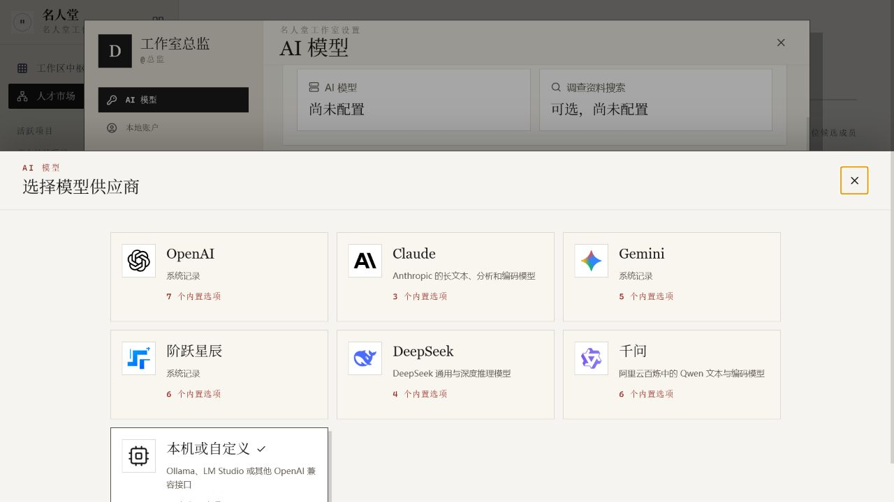
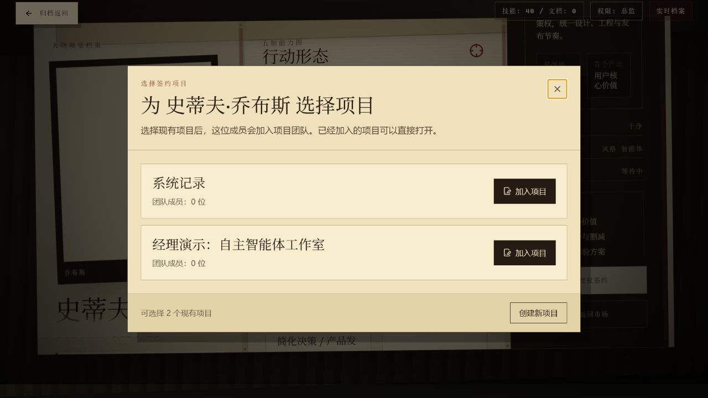

# Open-source accessibility audit evidence

Scope: the nested model-provider dialogs and the talent-to-project contract picker in the local Chinese product journey.

## 1. Model provider dialog — healthy

- Initial focus enters the dialog on its named close button.
- `Shift+Tab` wraps to the last provider and `Tab` wraps back to the close button.
- `Escape` closes only the top dialog and restores focus to the model-provider trigger.
- The settings dialog stays open while the nested provider or Stepfun region dialog closes.

## 2. Talent contract project picker — healthy

- Initial focus enters the named project-picker dialog.
- Keyboard focus remains inside the picker and wraps in both directions.
- `Escape` closes the picker and restores focus to the talent contract action.
- The visual backdrop is removed from the accessibility tree and the application background is inert while the picker is open.

## Evidence limits

This pass verified keyboard focus, modal isolation, accessible names, visible focus, Escape behavior, and focus restoration in the Codex in-app Chromium browser. It is not a formal WCAG conformance claim: manual NVDA/JAWS/VoiceOver output, forced-colors mode, and instrumented contrast measurements were not part of this run.
