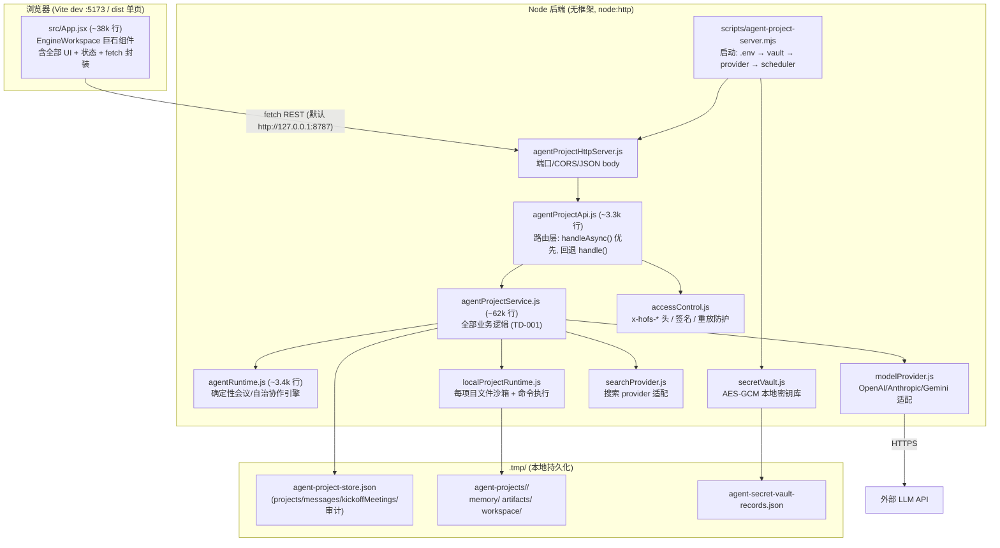

# Hall of Fame Studio 架构参考

> 目的：让任何人（或任何新 AI 会话）在 10 分钟内建立对本项目的完整认知。
> 基线：commit `0fa01378`（2026-07-08）。行为以代码为准，本文档描述现状（含已知债务），不描述理想态。
> 配套文档：[技术债登记册](TECH_DEBT_REGISTER.md) · [Bug 日志](BUG_LOG.md) · [Mock 替换登记册](FRONTEND_MOCK_REPLACEMENT_REGISTER.md) · [发布门禁](LAUNCH_READINESS_GATES.md)

## 1. 系统总览



关键事实：

- **前端有 mock 回退**：后端不可达时部分功能回退到前端 mock，这是有意设计。边界由 `scripts/validate-frontend-mock-boundaries.mjs` 强制，登记在 `FRONTEND_MOCK_REPLACEMENT_REGISTER.md`。
- **协作引擎是确定性的**：`agentRuntime.js` 不依赖 LLM 也能跑完整会议协议；LLM 只是增强（真实对话内容）。
- **无数据库**：一切状态在 JSON 文件里（见 §4）。

## 2. 启动与环境变量

| 命令 | 作用 |
|------|------|
| `npm run dev` | Vite 前端 :5173 |
| `npm run agents:server` | 后端 :8787 |
| `npm run build` | 生产构建（当前单 chunk 2.1MB，TD-008） |
| `npm run launch:gates` | 发布门禁 |

服务端环境变量（`agent-project-server.mjs` 读取，支持 `.env`）：

| 变量 | 默认 | 说明 |
|------|------|------|
| `AGENT_PROJECT_HOST` / `AGENT_PROJECT_PORT` | `127.0.0.1` / `8787` | 监听地址 |
| `AGENT_PROJECT_STORE` | `.tmp/agent-project-store.json` | 主状态文件 |
| `AGENT_PROJECT_RUNTIME_ROOT` | `.tmp/agent-projects` | 项目工作区根 |
| `AGENT_SECURITY_AUDIT_LOG` | `{store}.security-audit.jsonl` | 安全审计流 |
| `SECRET_VAULT_ENABLED` / `SECRET_VAULT_KEY` / `SECRET_VAULT_KEY_ID` / `SECRET_VAULT_RECORDS_FILE` | — | 本地密钥库 |
| `MODEL_PROVIDER` / `MODEL_NAME` / `MODEL_BASE_URL` / `MODEL_API_KEY`（或 `OPENAI/ANTHROPIC/GEMINI_API_KEY`） | — | LLM 配置；vault 中 `model.apikey` / `model.endpoint` / `model.name` 记录优先生效 |
| `MODEL_PROVIDER_ENABLED` / `AGENT_LLM_ENABLED` | — | LLM 总开关 |
| `AGENT_ACCESS_CONTROL_MODE` | `prototype-open` | 访问控制模式 |
| `AGENT_ACCESS_SIGNING_SECRET` / `AGENT_ACCESS_REPLAY_PROTECTION` / `AGENT_ACCESS_AUDIT_FAIL_CLOSED` | — | 签名/重放/审计 |
| `AGENT_AUTONOMOUS_SCHEDULER` / `AGENT_AUTONOMOUS_INTERVAL_MS` / `AGENT_AUTONOMOUS_AGENT_*` | — | 自治调度器 |
| `AGENT_WORKSPACE_EXEC` / `AGENT_WORKSPACE_ALLOWED_COMMANDS` | 关 | 工作区命令执行白名单 |

前端 Base URL 解析优先级：`window.__AGENT_BACKEND_URL__` → `localStorage['hall_of_fame_studio.agent_backend_url.v1']` → `VITE_AGENT_BACKEND_URL` → `http://127.0.0.1:8787`。

## 3. HTTP API 参考

通用规则：

- 路由 `/projects/{projectId}/{action}/…` 由 `parseProjectRoute()` 解析；`/kickoff-meetings/…`、`/workers/…` 是独立前缀。
- **双通道（TD-007）**：HTTP 层优先调 `api.handleAsync()`，未命中回退同步 `api.handle()`。涉及 LLM、provider 测试、文件选择器的路由只在 async 通道存在；给同步通道加这类路由会得到"接口存在但永远 400"。
- CORS 全开（`*`）；访问头 `x-hofs-access-mode/role/agent-id/user-id/signed-at/request-id/signature/session-token` 由 `accessControl.js` 校验，本地 prototype-open 模式下前端不发送这些头。
- `GET/POST /workers/autonomous/status|start|stop|tick` 由 HTTP 层直接处理（内置调度器），不经过 API 层。

`{P}` = `/projects/{projectId}`，标 **async** 的仅存在于异步通道。

### 全局

| Method | Path | Service 函数 |
|---|---|---|
| GET | `/projects` | `listProjects` |
| POST | `/projects/initiate` | `initiateProject` |
| POST | `/product-team-missions` | `startProductTeamMission` |
| GET | `/snapshot` | `snapshot` |
| GET | `/access-control-policy`、`/managed-{identity,secret-manager,persistence,worker-queue}-policy`、`/production-{provider-controls,data-governance,traffic,customer-acceptance,operations}-policy` | 对应 `get*Policy` |
| GET | `/local-mvp-startup-readiness`、`/public-production-startup-readiness`、`/settings/{health,runtime,provider}-readiness` | 对应 `get*Readiness` |
| POST | `/settings/workflow-smoke` | `runSettingsWorkflowSmoke`（**async** 版带 provider evidence） |

### 密钥库与 Provider

| Method | Path | Service 函数 |
|---|---|---|
| GET | `/secret-vault/status` / `/secret-vault/records` / `/provider-vault-bindings` | `getSecretVaultStatus` / `listSecretVaultRecords` / `getProviderVaultBindings` |
| POST | `/secret-vault/seal` / `/secret-vault/rotate` | `sealSecretVaultRecord` / `rotateSecretVaultRecords` **async** |
| GET | `/llm/status` / `/search/status` | `getModelProviderStatus` / `getSearchProviderStatus` |
| POST | `/llm/test` / `/search/test` | `testModelProvider` / `testSearchProvider` **async**（支持请求体带临时凭据，见 BUG-003） |

vault 记录名约定：`model.apikey` / `model.endpoint` / `model.name` / `search.apikey` / `search.endpoint`（+若干别名，词表在 `agent-project-server.mjs` 与 `agentProjectService.js` **两处复制**，改动必须同步，TD-005）。

### Kickoff 会议

| Method | Path | Service 函数 |
|---|---|---|
| GET/POST | `/kickoff-meetings` | `listKickoffMeetings` / `createKickoffMeeting[Async]` |
| GET | `/kickoff-meetings/{id}` | `getKickoffMeeting` |
| POST | `…/{id}/clarify` | `clarifyKickoffMeeting[Async]` |
| POST | `…/{id}/leader` / `next-actions` / `approve` | `confirmKickoffMeetingLeader` / `confirmKickoffMeetingNextActions` / `approveKickoffMeeting` |

LLM 会议生成链路（BUG-002 修复后）：轻量行格式请求（`agentId | type | text`）→ 失败回退完整 JSON（8192 tokens）→ 容错 JSON 提取 → LLM 修复重试 → 主题匹配校验 → strictTopic 重试。

### 项目核心 / 转录 / Agents

| Method | Path | Service 函数 |
|---|---|---|
| GET/PUT | `{P}` | `getProject`+`getMessages` / `replaceProject` |
| GET | `{P}/messages` · POST `{P}/chat` / `meeting` / `change-request` / `autonomous-cycle` | `getMessages` / `submitChatMessage` / `submitMeetingMessage` / `submitMultiChannelChangeRequest` / `runAutonomousCycle` |
| GET/PUT | `{P}/project-settings` / `membership-policy` | `get/setProjectSettings` / `get/setProjectMembershipPolicy` |
| GET | `{P}/transcripts[/search|/{ch}|/{ch}/members]` | `getTranscriptIndex` / `searchTranscripts` / `getChannelTranscript` / `getTranscriptMemberPresence` |
| POST | `{P}/transcripts[…/pins|channel-pin|replies|mentions|attachments]` | `createTranscriptChannel` / `pinTranscriptMessage` / `pinTranscriptChannel` / `replyToTranscriptMessage` / `mentionTranscriptMessage` / `attachTranscriptFile` |
| GET | `{P}/meeting-summaries` / `timeline` / `events` · POST `{P}/timeline/actions` | `getMeetingSummaries` / `getTimeline` / `getEventLedger` / `recordTimelineAction` |
| GET | `{P}/agents[/{id}/state|inbox|worklog|obligations|plan|dashboard]` | `listAgentStates` / `getAgentState` / `getAgentDashboard` |
| POST | `{P}/agents/contract` / `…/{id}/message` / `submissions` / `artifact-drafts`(**async**) / `evidence-searches`(**async**) / `work-cycle`(**async**) | `contractProjectAgent` / `submitAgentMessage` / `submitAgentArtifact` / `generateAgentArtifactDraft` / `recordAgentEvidenceSearch[WithProvider]` / `runAgentWorkCycle[WithProviderEvidence]` |
| GET | `{P}/tasks[/{id}[/evidence]]` / `submissions[/{id}]` / `submission-reviews` · POST `{P}/submissions/{id}/reviews` | `listTasks` / `getTask` / `getTaskEvidence` / `listSubmissions` / `reviewAgentSubmission` 等 |

### 自治 / Manager / 证据 / 运维（大类概览）

- 证据与质量：`{P}/evidence-searches`、`evidence-quality-audit`、`evidence-{index,custody}-readiness`、`evidence-source-review-workflow`（GET+POST）、`artifact-quality-audit`、`memory-readiness`、`budget-alert-readiness`、`error-reporting-readiness` —— 均映射同名 `get*/review*` 函数。
- Manager：`{P}/manager-{dashboard,flow-graph,ready-package,command-center,action-queue,scenario-walkthrough,requirement-matrix}`（GET）+ `…/run|run-next|confirm`（POST）。
- 自治运行：`{P}/autonomous-run-control[/sessions[/start|/{id}/tick|pause]]`、`agent-autonomous-action-queue[/{agentId}/run]`（**async** 版带 provider evidence）、`collaboration-intent-queue[/{id}/run]`、`runtime-contracts`、`runtime-autonomy-status`。
- Workers：`POST /workers/{autonomous,agents,autopilot}/due`、`/workers/queue-snapshot`。
- 项目工作区：`{P}/workspace/{bind,list,read,write,delete,exec}`（POST）、`{P}/local-runtime[/archive]`；全局 `POST /workspace/prepare`、`POST /workspace/pick-folder`（**仅 async**，见 BUG-001）。
- 发布/收据/安全/试点：`{P}/persistence-*`、`operations-readiness`、`deployment-preflight`、`private-pilot-*`、`launch-*`、`production-*-control-receipts`、`security-{boundary,access-audit,audit-stream}`、`identity-sessions`、`provider-{readiness,controlled-run,eval-runs}` —— GET 读 workflow 快照，POST 记录收据/证明（`record*`）。

## 4. 持久化格式

`AGENT_PROJECT_STORE`（`agentProjectFileStore.js` 的 `writeSnapshot`）顶层：

```json
{
  "version": 1,
  "updatedAt": "<ISO>",
  "projects": [],
  "messages": [],
  "kickoffMeetings": [],
  "securityAccessAuditRecords": [],
  "accessReplayRecords": []
}
```

- `hydrateAgentProject()` 加载时做 worker-run 回填与事件账本补全，不新增顶层键。
- 每个项目的文件工作区：`.tmp/agent-projects/<projectId>/{memory,artifacts,workspace}/`。
- vault 记录（AES-GCM 密文）在 `SECRET_VAULT_RECORDS_FILE`。

## 5. 前端集成要点（App.jsx）

- 唯一底层 fetch 封装：`requestAgentBackend(path, {method, body, timeoutMs, baseUrl})`，自动注入 `language`，`AbortController` 控制超时。
- 各领域有对应 `syncBackend*` 读模型函数（projects / transcripts / meeting-summaries / timeline / manager 系列 / readiness 系列），及写操作封装（pin/reply/mention/attachment/seal 等）。
- 运行时后端地址状态在 `backendStation.baseUrl`。

## 6. 测试与验证体系

| 层 | 工具 | 说明 |
|----|------|------|
| 契约（静态） | `scripts/validate-*-contract.mjs` | 读源码断言 API 形状；与实现强耦合（TD-009） |
| UI/端到端 | `scripts/validate-*-ui.mjs`（Playwright） | 起真实前后端跑流程 |
| 发布门禁 | `npm run launch:gates`、`validate-local-mvp-release-checklist.mjs` | MVP 发布口径 |
| 单元测试 | **无**（TD-003） | 计划用 `node --test` 补，从纯函数开始 |

## 7. 修改守则（对人与 AI 同样适用）

1. **行为不变是默认约束**；行为变化只能来自 `BUG_LOG.md` 里登记的 bug 修复。
2. 涉及 provider 密钥词表的改动，`agent-project-server.mjs` 和 `agentProjectService.js` 两处必须同步（直到 TD-005 合并）。
3. 新路由若依赖 async（LLM/文件对话框/网络），只加到 `handleAsync` 通道，同步通道返回明确错误。
4. 动 `agentProjectService.js` / `App.jsx` 前先跑对应 validate 脚本记录基线，改完复跑。
5. 每个独立改动一个 commit，信息写明动机；bug 修复引用 BUG 编号。

## 8. Local Dashboard Workspace file manager

- The selected project folder remains the source of truth. The Dashboard opens it in an in-place right drawer; it does not copy, upload, synchronize, or introduce a cloud storage layer.
- `ProjectDashboardWorkspaceDrawer` lazy-loads directories and exposes text read/write, folder/file creation, rename/move, and guarded deletion through project-scoped local backend routes. Binary files are metadata-only.
- Workspace mutations are resolved beneath the canonical `project.localRuntime.workspacePath`. Absolute child paths, traversal, symbolic-link escapes, root mutation, destination overwrite, and stale writes are rejected. The drawer exposes no command execution surface.
- Routes are `POST {P}/workspace/{list,read,write,mkdir,move,delete}`. `expectedUpdatedAt` provides optimistic conflict detection for files that an Agent changed while the user was editing.
- `npm run ui:project-dashboard-workspace` builds the app and validates the real Dashboard flow against an isolated local folder, including expansion, edit/save, folder creation, outside-folder preservation, and browser diagnostics.

## 9. Outcome-driven Agent runtime

Autonomous work uses a material-delivery protocol instead of activity-based progress. A normalized `WorkContract` selects the required executor and evidence shape for research, technical delivery, creative, operations, or general work. Only an independently accepted material submission advances outcome progress; chat, pulses, receipts, templates, and coordination do not.

Provider-required work fails closed, two no-output cycles trigger `STALLED_NO_MATERIAL_DELTA`, and handoffs use `material-handoff/v1` with artifact/version/checksum/evidence/open-question/next-owner fields. See [OUTCOME_DRIVEN_AGENT_RUNTIME.md](./OUTCOME_DRIVEN_AGENT_RUNTIME.md) and run `npm run agents:outcome-runtime` for the focused cross-project acceptance gate.
